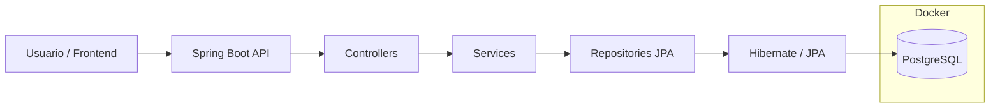
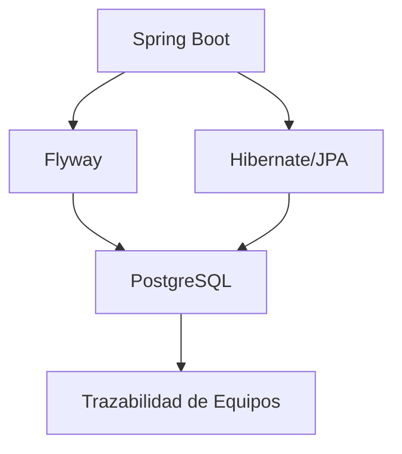

# Protecciones Trazabilidad

Sistema de trazabilidad e inventario de relés de protección e IEDs orientado a la gestión de stock, movimientos, historial y auditoría de equipos utilizados en el área de protecciones eléctricas.

---

# Objetivo

Centralizar y digitalizar la trazabilidad de:
- relés de protección
- IEDs
- movimientos de stock
- ubicaciones
- estados de equipos
- historial de intervenciones

El sistema busca reemplazar procesos manuales y facilitar futuras integraciones con plataformas corporativas como IBM Maximo mediante APIs o MIF.

---

# Stack Tecnológico

## Backend
- Java 21
- Spring Boot 4
- Spring Data JPA
- Hibernate
- Maven

## Base de Datos
- PostgreSQL 16
- Flyway

## Infraestructura
- Docker
- Docker Compose

## Frontend (futuro)
- React
- TypeScript

---

# Arquitectura General



---

# Puertos Utilizados

| Componente | Puerto |
|---|---|
| Spring Boot API | 8082 |
| PostgreSQL Docker | 5433 |
| PostgreSQL Interno Docker | 5432 |

---

# Flujo Actual del Sistema



---

# Estructura del Proyecto

```text
backend/
├── src/main/java/
│   ├── controller/
│   ├── service/
│   ├── repository/
│   ├── entity/
│   ├── dto/
│   ├── mapper/
│   ├── config/
│   └── exception/
│
├── src/main/resources/
│   ├── db/migration/
│   └── application.properties
│
└── pom.xml

docker/
└── docker-compose.yml
```

---

# Responsabilidad de Cada Capa

## controller
Expone endpoints REST y recibe requests HTTP.

## service
Contiene la lógica de negocio del sistema.

## repository
Acceso a base de datos mediante Spring Data JPA.

## entity
Modelos persistentes mapeados a tablas SQL.

## dto
Objetos utilizados para intercambio de datos vía API.

## mapper
Transformación entre DTOs y Entities.

## config
Configuraciones generales del sistema.

## exception
Manejo centralizado de errores y excepciones.

## db/migration
Migraciones SQL versionadas mediante Flyway.

---

# Base de Datos Versionada

La estructura de base de datos se administra mediante Flyway.

Ejemplo de migraciones:

```text
V1__initial_schema.sql
V2__create_ied_table.sql
V3__create_movimiento_table.sql
```

Cada cambio estructural debe realizarse mediante una nueva migration.

---

# Convenciones de Desarrollo

- Un commit por cambio lógico
- Arquitectura por capas
- Base de datos versionada con Flyway
- Convención REST para endpoints
- Uso de migraciones incrementales
- Separación entre lógica de negocio y persistencia

---

# Estado Actual

## Implementado
- Entorno Docker
- PostgreSQL
- Spring Boot
- Flyway
- Hibernate/JPA
- Primera migration ejecutada
- Backend operativo

## Próximos Pasos
- Modelado completo del dominio
- CRUD de entidades principales
- Gestión de movimientos
- Historial de trazabilidad
- API REST
- Frontend React
- Integración futura con Maximo/MIF

---

# Ejecución Local

## Levantar PostgreSQL

```bash
cd docker
docker compose up -d
```

## Ejecutar Backend

```bash
cd backend
./mvnw spring-boot:run
```

---

# Autor

Proyecto desarrollado como iniciativa de mejora y digitalización de procesos para el área de Protecciones y Teleoperación.