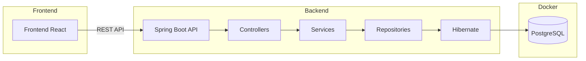
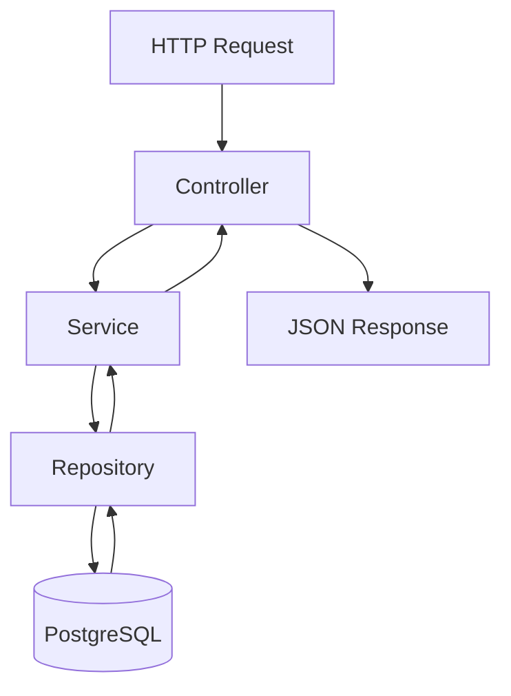
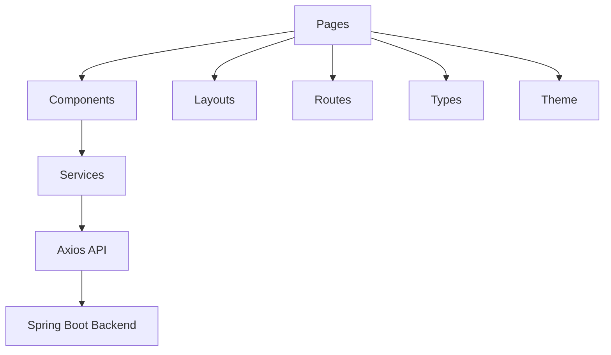
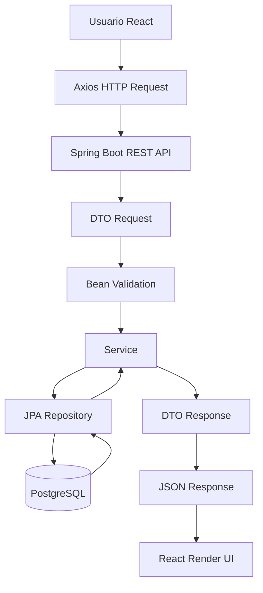
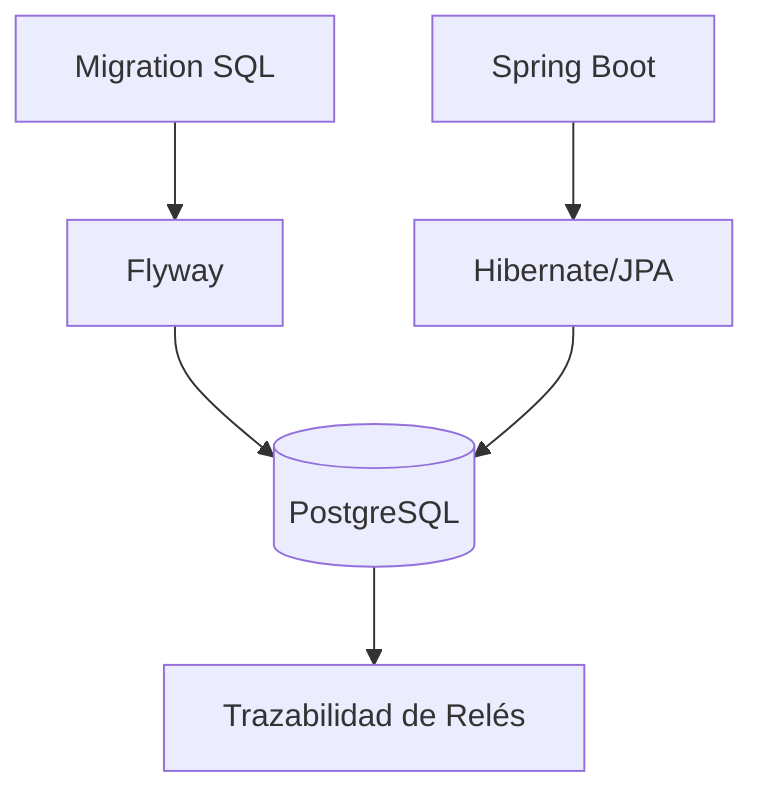
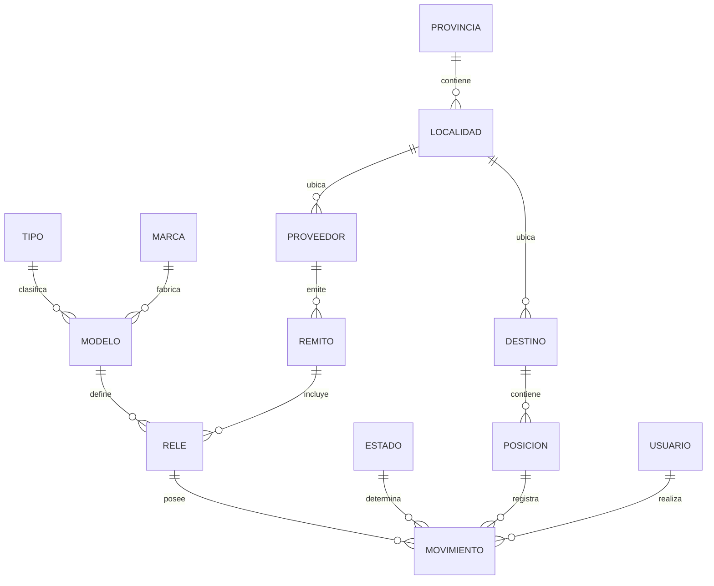
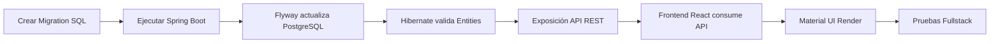

# Protecciones Trazabilidad

Sistema fullstack enterprise de gestión y trazabilidad de relés de protección para EPEC Transmisión — Departamento de Teleoperaciones y Protecciones.

La aplicación permite administrar:

- relés de protección
- modelos y marcas
- tensiones auxiliares
- movimientos operativos
- historial operativo
- estados
- posiciones
- destinos
- localidades
- provincias
- remitos
- proveedores
- usuarios responsables

mediante una arquitectura desacoplada React + Spring Boot + PostgreSQL.

---

# Objetivo

Centralizar y digitalizar la trazabilidad operativa de:

- relés de protección
- movimientos operativos
- estados de equipos
- posiciones físicas
- destinos y ubicaciones
- historial de intervenciones
- remitos y proveedores
- usuarios responsables

El sistema busca reemplazar procesos manuales realizados previamente en Microsoft Access y servir como base para futuras integraciones corporativas:

- IBM Maximo
- APIs REST
- MIF
- dashboards operativos
- reporting técnico
- auditoría operacional

---

# Estado Actual del Proyecto

```text
Aplicación fullstack enterprise funcional
```

Actualmente el sistema ya posee:

- backend REST profesional
- frontend React desacoplado
- PostgreSQL
- Flyway
- Docker
- Material UI
- identidad visual institucional
- CRUDs operativos
- trazabilidad histórica
- catálogos dinámicos
- seed data automática
- integración React ↔ Spring Boot
- arquitectura escalable
- UX enterprise

---

# Stack Tecnológico

## Backend

- Java 21
- Spring Boot
- Spring Data JPA
- Hibernate
- Maven
- Bean Validation

## Base de Datos

- PostgreSQL 16
- Flyway

## Frontend

- React
- TypeScript
- Vite
- Axios
- React Router DOM
- Material UI

## Infraestructura

- Docker
- Docker Compose

## API Docs

- Swagger/OpenAPI

---

# Identidad Visual

La aplicación implementa una interfaz institucional basada en EPEC Transmisión.

## Características UI/UX

- Theme corporativo institucional
- Navbar enterprise
- Branding EPEC
- Logo institucional
- Layout responsive
- Material UI
- Formularios modernos
- Snackbar notifications
- Dialogs de confirmación
- Feedback visual
- Loading states
- Diseño orientado a operación técnica
- UX enterprise

---

# Arquitectura General



---

# Arquitectura Backend



---

# Arquitectura Frontend



---

# Flujo Fullstack Actual



---

# Flujo de Persistencia



---

# Estructura del Proyecto

```text
backend/
├── src/main/java/
│
│   ├── controller/
│   ├── service/
│   ├── repository/
│   ├── entity/
│   ├── dto/
│   ├── mapper/
│   ├── config/
│   ├── exception/
│   └── security/
│
├── src/main/resources/
│   ├── db/migration/
│   └── application.properties
│
└── pom.xml

frontend/
├── src/
│
│   ├── api/
│   ├── assets/
│   ├── components/
│   ├── layouts/
│   ├── pages/
│   ├── routes/
│   ├── services/
│   ├── theme/
│   ├── types/
│   └── App.tsx
│
├── public/
│
└── package.json

docker/
└── docker-compose.yml
```

---

# Responsabilidad Backend

## controller

Expone endpoints REST y maneja requests HTTP.

## service

Contiene la lógica de negocio.

## repository

Acceso a base de datos mediante Spring Data JPA.

## entity

Entidades persistentes mapeadas a PostgreSQL.

## dto

Objetos desacoplados utilizados por la API.

## mapper

Conversión entre DTOs y entidades.

## config

Configuraciones generales del sistema.

## exception

Manejo centralizado de excepciones.

## security

Preparado para futura autenticación y autorización.

## db/migration

Migraciones SQL versionadas mediante Flyway.

---

# Responsabilidad Frontend

## pages

Pantallas principales del sistema.

## components

Componentes reutilizables de UI.

## layouts

Layouts globales y navegación.

## routes

Configuración React Router.

## services

Comunicación HTTP con backend.

## api

Configuración Axios global.

## types

Tipos TypeScript desacoplados.

## theme

Theme institucional Material UI.

---

# Base de Datos Versionada

Administrada mediante Flyway.

## Migraciones actuales

```text
V1__initial_catalogs.sql
V2__create_location_and_provider.sql
V3__create_rele_domain.sql
V4__create_movimiento_and_usuario.sql
V5__seed_initial_data.sql
V6__insert_real_operational_data.sql
V7__improve_catalog_management.sql
V8__seed_modelo_tensiones.sql
```

---

# Seed Data Operacional

El sistema implementa bootstrap automático de datos reales y operativos.

## Datos incluidos

### Catálogos

- Provincias
- Localidades
- Estados
- Marcas
- Tipos

### Operación

- Destinos reales
- Posiciones reales
- Modelos reales
- Relés reales
- Remitos
- Usuario sistema

### Datos operativos simulados

- ABB REL670
- ABB REG670
- Siemens SIPROTEC
- GE Multilin
- AREVA MiCOM

Esto permite levantar el entorno completamente funcional sin inserciones manuales.

---

# Modelo Relacional



---

# Entidades Implementadas

## Catálogos

- Marca
- Tipo
- Estado
- Provincia
- Localidad

## Dominio Principal

- Modelo
- Rele
- Movimiento

## Ubicaciones

- Destino
- Posicion

## Gestión Logística

- Proveedor
- Remito

## Usuarios

- Usuario

---

# Gestión de Marcas

## Funcionalidades implementadas

- Crear marcas
- Editar marcas
- Eliminar marcas
- Validaciones
- Prevención de eliminación con relaciones activas
- Confirmación visual
- Snackbar enterprise
- CRUD fullstack real

---

# Gestión de Modelos

## Funcionalidades implementadas

- Crear modelos
- Editar modelos
- Eliminar modelos
- Asociación Marca ↔ Modelo
- Asociación Tipo ↔ Modelo
- Gestión de tensiones auxiliares
- UX enterprise
- CRUD fullstack real

---

# Gestión de Tensiones

El sistema implementa modelado estructurado de tensiones auxiliares.

## Campos

- tensionDesde
- tensionHasta
- tipoTension

## Ejemplos

- 48 - 250 VCC
- 24 - 220 VCA
- 110 VCC

## Campo derivado

```text
tensionCompleta
```

generado automáticamente desde backend.

---

# Gestión de Relés

## Funcionalidades implementadas

- Alta de relés
- Asociación con modelos
- Número de serie
- Garantía
- Historial operativo
- Asociación logística

## Próxima mejora

Adaptar la pantalla de relés tomando como referencia el Access original:

- Marca
- Modelo
- Tensión auxiliar
- Número de serie
- Garantía
- Proveedor
- Remito
- Fecha de inicio garantía

---

# Gestión de Movimientos

## Funcionalidades implementadas

- Registro de movimientos
- Estados operativos
- Posiciones
- Historial de trazabilidad
- Notas operativas
- Responsable
- Fecha de movimiento

## Próxima mejora

Implementar lógica operacional similar al sistema Access:

- Provincia
- Localidad
- Destino
- Posición
- Estado
- Responsable
- Fecha movimiento
- Etiquetas operativas
- filtros dinámicos

---

# APIs REST Implementadas

## Catálogos

- /api/tipos
- /api/marcas
- /api/estados
- /api/provincias
- /api/localidades
- /api/posiciones

## Dominio principal

- /api/modelos
- /api/reles
- /api/movimientos

## Ubicaciones

- /api/destinos

## Gestión logística

- /api/proveedores
- /api/remitos

## Usuarios

- /api/usuarios

---

# Endpoints Avanzados

## Relés

### Obtener relés paginados

```http
GET /api/reles?page=0&size=10
```

### Sorting dinámico

```http
GET /api/reles?page=0&size=10&sort=numeroSerie,asc
```

### Buscar serial exacto

```http
GET /api/reles/serial/REL-001
```

### Buscar serial parcial

```http
GET /api/reles/buscar?serial=REL
```

### Historial de movimientos

```http
GET /api/reles/1/movimientos
```

### Obtener estado actual

```http
GET /api/reles/1/estado-actual
```

### Filtrar por estado actual

```http
GET /api/reles/estado/INSTALADO
```

### Opciones frontend

```http
GET /api/reles/opciones
```

---

# Swagger/OpenAPI

## Acceso local

```text
http://localhost:8082/swagger-ui/index.html
```

---

# Docker

## PostgreSQL persistente

El sistema utiliza volúmenes Docker persistentes:

```yaml
volumes:
  - postgres_data:/var/lib/postgresql/data
```

Esto permite conservar la información incluso si el contenedor es eliminado.

---

# Puertos Utilizados

| Componente | Puerto |
|---|---|
| Frontend React/Vite | 5173 |
| Spring Boot API | 8082 |
| PostgreSQL Host | 5433 |
| PostgreSQL Interno Docker | 5432 |

---

# Dashboard Futuro

El sistema fue diseñado para soportar dashboards operativos.

## Métricas previstas

- Relés por estado
- Relés por destino
- Relés instalados
- Equipos en reparación
- Garantías próximas a vencer
- Últimos movimientos
- Modelos más utilizados
- Marcas más utilizadas

## Tecnologías previstas

- Recharts
- MUI Charts
- KPIs operativos

---

# Capacidades Backend

## Persistencia

- Hibernate/JPA
- PostgreSQL
- Spring Data JPA

## Arquitectura

- Arquitectura por capas
- DTOs desacoplados
- Bean Validation
- Exception Handling
- Responses REST profesionales

## REST API

- CRUD completo
- Status HTTP correctos
- JSON responses
- ResponseEntity

## Trazabilidad

- Historial de movimientos
- Estado actual derivado
- Tracking operativo

## Queries avanzadas

- búsqueda exacta por serial
- búsqueda parcial
- filtros por estado
- paginación
- sorting dinámico

---

# Capacidades Frontend

## Arquitectura

- React + TypeScript
- Arquitectura desacoplada
- React Router
- Axios centralizado
- Componentización

## UI/UX

- Material UI
- Theme institucional EPEC
- Navbar corporativa
- Branding Transmisión
- Formularios enterprise
- Selects dinámicos
- Tablas operativas
- Loading states
- Snackbars
- Dialogs
- Feedback visual

## Fullstack

- Consumo API real
- CRUD operativo
- Persistencia funcional
- Integración React ↔ Spring Boot

---

# Próximos Pasos

## Frontend

- Mejorar módulo Relés
- Mejorar módulo Movimientos
- Dashboard operativo
- DataGrid avanzado
- Filtros visuales
- KPIs operativos
- Paginación frontend

## Backend

- Queries avanzadas
- Soft delete
- Auditoría automática
- Seguridad JWT
- Roles y permisos
- Optimización de queries

## Integraciones futuras

- IBM Maximo
- MIF
- APIs corporativas
- Exportación Excel/PDF

---

# Convenciones de Desarrollo

- Un commit por cambio lógico
- Arquitectura desacoplada
- Base de datos versionada con Flyway
- Uso de migraciones incrementales
- No modificar migrations ejecutadas
- Separación entre lógica y persistencia
- Convención REST para endpoints

---

# Ejecución Local

## Levantar PostgreSQL

```bash
cd docker
docker compose up -d
```

---

## Ejecutar Backend

```bash
cd backend
./mvnw.cmd spring-boot:run
```

---

## Ejecutar Frontend

```bash
cd frontend
npm install
npm run dev
```

---

## Frontend

```text
http://localhost:5173
```

---

## Swagger

```text
http://localhost:8082/swagger-ui/index.html
```

---

## Verificar Docker

```bash
docker ps
```

---

## Reinicio completo

```bash
docker compose down -v
docker compose up -d
```

---

# Flujo de Trabajo Actual



---

# Autor

Proyecto desarrollado como iniciativa de modernización y digitalización operativa para el área de Protecciones y Teleoperación de EPEC Transmisión.