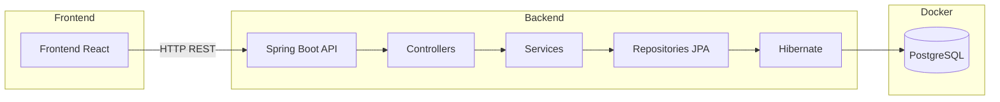
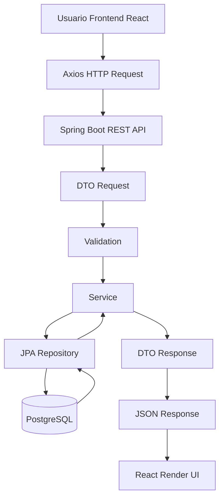
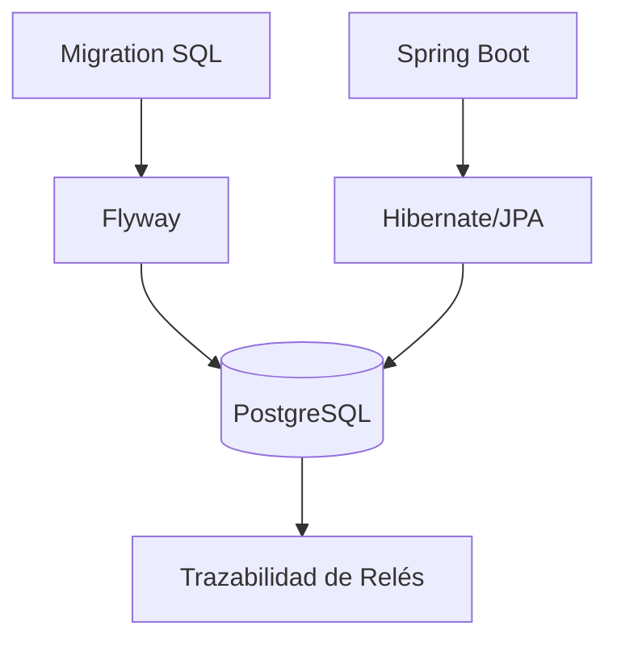
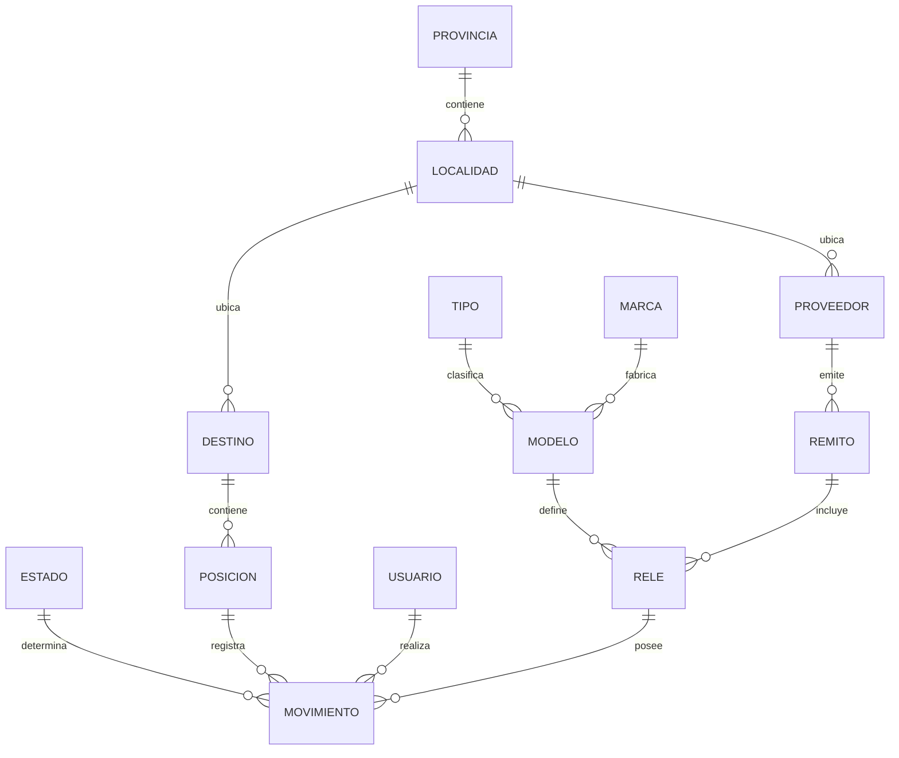
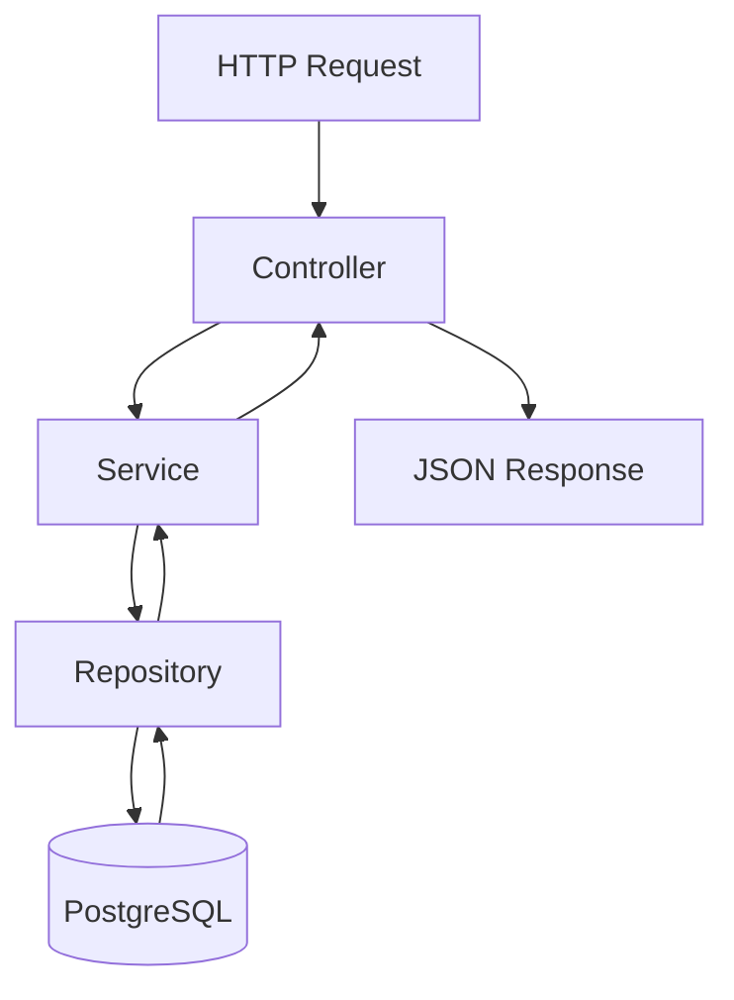
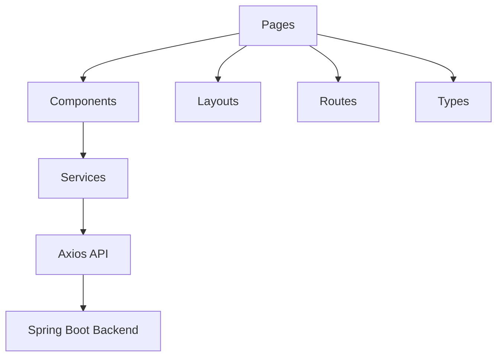
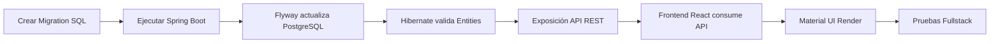

# Protecciones Trazabilidad

Sistema de trazabilidad e inventario de relés de protección orientado a la gestión de stock, movimientos, historial y auditoría de equipos utilizados en el área de Protecciones y Teleoperación.

---

# Objetivo

Centralizar y digitalizar la trazabilidad de:
- relés de protección
- movimientos de stock
- ubicaciones
- estados operativos
- historial de intervenciones
- remitos y proveedores
- posiciones y destinos
- usuarios responsables

El sistema busca reemplazar procesos manuales y facilitar futuras integraciones con plataformas corporativas como IBM Maximo mediante APIs REST o MIF.

---

# Stack Tecnológico

## Backend
- Java 21
- Spring Boot 4
- Spring Data JPA
- Hibernate
- Maven

## Base de Datos
- PostgreSQL 16
- Flyway

## Infraestructura
- Docker
- Docker Compose

## Frontend
- React
- TypeScript
- Vite
- Axios
- React Router
- Material UI

## Documentación API
- Swagger / OpenAPI

---

# Arquitectura General



---

# Flujo Fullstack Actual



---

# Flujo de Persistencia



---

# Puertos Utilizados

| Componente | Puerto |
|---|---|
| Frontend React/Vite | 5173 |
| Spring Boot API | 8082 |
| PostgreSQL Docker | 5433 |
| PostgreSQL Interno Docker | 5432 |

---

# Modelo de Dominio Actual



---

# Arquitectura Backend



---

# Arquitectura Frontend



---

# Estructura del Proyecto

```text
backend/
├── src/main/java/
│
│   ├── controller/
│   ├── service/
│   ├── repository/
│   ├── entity/
│   ├── dto/
│   ├── mapper/
│   ├── config/
│   └── exception/
│
├── src/main/resources/
│   ├── db/migration/
│   └── application.properties
│
└── pom.xml

frontend/
├── src/
│
│   ├── api/
│   ├── components/
│   ├── layouts/
│   ├── pages/
│   ├── routes/
│   ├── services/
│   ├── types/
│   └── App.tsx
│
└── package.json

docker/
└── docker-compose.yml
```

---

# Responsabilidad de Cada Capa Backend

## controller
Expone endpoints REST y recibe requests HTTP.

## service
Contiene la lógica de negocio del sistema.

## repository
Acceso a base de datos mediante Spring Data JPA.

## entity
Modelos persistentes mapeados a tablas SQL.

## dto
Objetos utilizados para intercambio de datos vía API.

## mapper
Transformación entre DTOs y Entities.

## config
Configuraciones generales del sistema.

## exception
Manejo centralizado de errores y excepciones.

## db/migration
Migraciones SQL versionadas mediante Flyway.

---

# Responsabilidad de Cada Capa Frontend

## pages
Pantallas principales de la aplicación.

## components
Componentes reutilizables de UI.

## layouts
Layouts globales de navegación y estructura.

## routes
Configuración centralizada de rutas React Router.

## services
Comunicación HTTP con backend mediante Axios.

## api
Configuración global de Axios.

## types
Tipos TypeScript desacoplados del backend.

---

# Base de Datos Versionada

La estructura de base de datos se administra mediante Flyway.

## Migraciones actuales

```text
V1__initial_catalogs.sql
V2__create_location_and_provider.sql
V3__create_rele_domain.sql
V4__create_movimiento_and_usuario.sql
```

Cada cambio estructural debe realizarse mediante una nueva migration.

Ejemplo:

```text
V5__add_observaciones_to_rele.sql
```

---

# Modelo Implementado en PostgreSQL

## Tablas actuales

- tipo
- marca
- estado
- provincia
- localidad
- proveedor
- destino
- posicion
- modelo
- remito
- rele
- usuario
- movimiento
- flyway_schema_history

---

# Entidades JPA Implementadas

## Catálogos
- Tipo
- Marca
- Estado
- Provincia
- Localidad

## Dominio principal
- Modelo
- Rele
- Movimiento

## Ubicaciones
- Destino
- Posicion

## Gestión logística
- Proveedor
- Remito

## Usuarios
- Usuario

---

# Capacidades Actuales del Backend

## Persistencia
- Hibernate/JPA
- PostgreSQL
- Repositories Spring Data

## Arquitectura
- Arquitectura por capas
- DTOs
- Validaciones
- Exception Handling global
- Responses REST desacopladas

## REST API
- CRUD base
- Status HTTP correctos
- JSON responses
- ResponseEntity

## Documentación
- Swagger/OpenAPI
- Documentación automática

## Trazabilidad
- Historial de movimientos
- Estado actual derivado
- Tracking operativo

## Queries y búsquedas
- Búsqueda exacta por serial
- Búsqueda parcial por serial
- Filtros por estado actual
- Queries derivadas JPA

## Escalabilidad
- Paginación
- Sorting dinámico
- Consultas configurables

---

# Capacidades Actuales del Frontend

## Arquitectura
- React + TypeScript
- Arquitectura desacoplada
- React Router
- Componentización
- Services desacoplados
- Axios centralizado

## UI/UX
- Material UI
- Navbar corporativa
- Tabla enterprise
- Formularios modernos
- Feedback visual
- Loading states
- Snackbars de éxito/error

## Fullstack
- Consumo API real
- CRUD operativo
- Integración React ↔ Spring Boot
- CORS configurado
- Persistencia fullstack funcional

---

# APIs REST Implementadas

## Catálogos
- /api/tipos
- /api/marcas
- /api/estados
- /api/provincias
- /api/localidades

## Dominio principal
- /api/modelos
- /api/reles
- /api/movimientos

## Ubicaciones
- /api/destinos
- /api/posiciones

## Gestión logística
- /api/proveedores
- /api/remitos

## Usuarios
- /api/usuarios

---

# Endpoints Avanzados Implementados

## Relés

### Obtener relés paginados
```http
GET /api/reles?page=0&size=10
```

### Sorting dinámico
```http
GET /api/reles?page=0&size=10&sort=numeroSerie,asc
```

### Buscar por serial exacto
```http
GET /api/reles/serial/REL-001
```

### Buscar por serial parcial
```http
GET /api/reles/buscar?serial=REL
```

### Obtener historial de movimientos
```http
GET /api/reles/1/movimientos
```

### Obtener estado actual
```http
GET /api/reles/1/estado-actual
```

### Filtrar por estado actual
```http
GET /api/reles/estado/INSTALADO
```

---

# Swagger / OpenAPI

## Acceso local

```text
http://localhost:8082/swagger-ui/index.html
```

---

# Estado Actual

## Backend implementado
- Entorno Docker
- PostgreSQL
- Spring Boot
- Flyway
- Hibernate/JPA
- Modelo relacional completo
- Versionado de base de datos
- Arquitectura backend por capas
- Entidades JPA
- DTOs
- Validaciones Bean Validation
- Exception Handling global
- Swagger/OpenAPI
- Repositories
- Services
- Controllers REST
- Endpoints CRUD
- Queries derivadas JPA
- Historial de movimientos
- Estado actual derivado
- Filtros operativos
- Paginación
- Sorting dinámico
- Persistencia funcional

---

## Frontend implementado
- React + Vite
- TypeScript
- Axios
- React Router
- Material UI
- Arquitectura frontend desacoplada
- Navbar y layout principal
- Tabla de relés
- Formulario de alta
- Loading states
- Snackbar feedback
- CRUD frontend operativo
- Integración fullstack funcional

---

# Próximos Pasos

## Frontend
- Selects dinámicos
- Catálogos reales
- Dashboard operativo
- DataGrid avanzado
- Dialogs
- Filtros visuales
- Paginación frontend
- Dark mode

## Backend
- Queries avanzadas
- Filtros múltiples
- Auditoría automática
- Soft delete
- Seguridad/JWT
- Roles y permisos
- Optimización de queries
- Dockerización completa backend

## Integraciones futuras
- IBM Maximo
- MIF
- APIs corporativas
- Exportación Excel/PDF

---

# Convenciones de Desarrollo

- Un commit por cambio lógico
- Arquitectura desacoplada
- Base de datos versionada con Flyway
- Convención REST para endpoints
- Uso de migraciones incrementales
- Separación entre lógica de negocio y persistencia
- No modificar migrations ya ejecutadas
- Toda modificación estructural debe realizarse mediante una nueva versión Flyway

---

# Ejecución Local

## Levantar PostgreSQL

```bash
cd docker
docker compose up -d
```

---

## Ejecutar Backend

```bash
cd backend
./mvnw.cmd spring-boot:run
```

---

## Ejecutar Frontend

```bash
cd frontend
npm install
npm run dev
```

---

## Acceder Frontend

```text
http://localhost:5173
```

---

## Acceder Swagger

```text
http://localhost:8082/swagger-ui/index.html
```

---

## Verificar contenedores Docker

```bash
docker ps
```

---

## Detener contenedores

```bash
docker compose down
```

---

# Flujo de Trabajo Actual



---

# Estado Arquitectónico Actual

```text
Aplicación fullstack enterprise base funcional
```

Con:
- backend REST profesional
- frontend React desacoplado
- Material UI
- arquitectura escalable
- persistencia fullstack
- trazabilidad histórica
- documentación OpenAPI
- integración React ↔ Spring Boot
- paginación y escalabilidad inicial

---

# Autor

Proyecto desarrollado como iniciativa de mejora y digitalización de procesos para el área de Protecciones y Teleoperación.