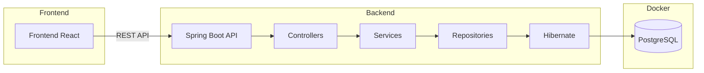
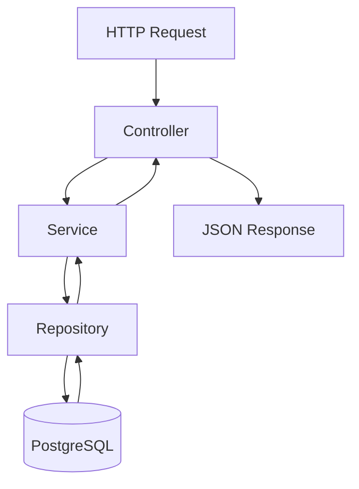
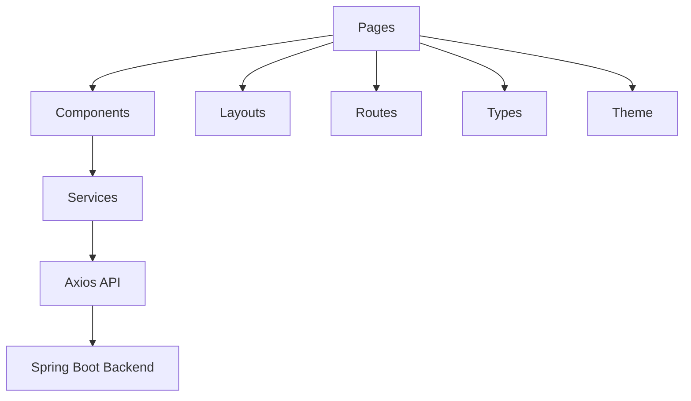
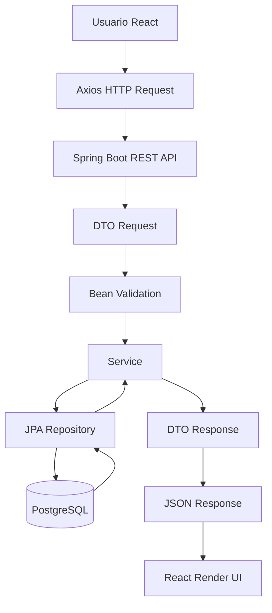
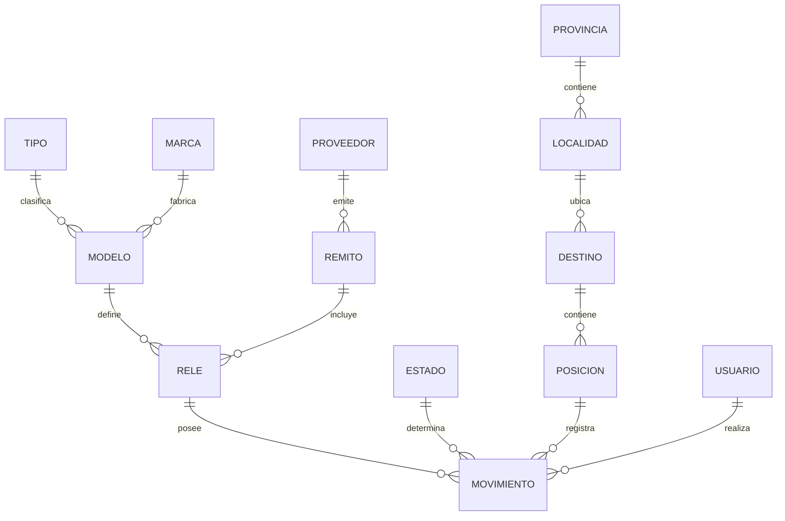

# Protecciones Trazabilidad

Sistema fullstack enterprise de gestión y trazabilidad operativa de relés de protección para EPEC Transmisión — Departamento de Teleoperaciones y Protecciones.

La aplicación permite administrar:

- relés de protección
- modelos y marcas
- tensiones auxiliares
- movimientos operativos
- historial operativo
- estados
- posiciones
- destinos
- localidades
- provincias
- remitos
- proveedores
- usuarios responsables

mediante una arquitectura desacoplada React + Spring Boot + PostgreSQL.

---

# Objetivo

Centralizar y digitalizar la trazabilidad operativa de:

- relés de protección
- movimientos operativos
- estados de equipos
- posiciones físicas
- destinos y ubicaciones
- historial de intervenciones
- remitos y proveedores
- usuarios responsables

El sistema busca reemplazar procesos manuales realizados previamente en Microsoft Access y servir como base para futuras integraciones corporativas:

- IBM Maximo
- APIs REST
- MIF
- dashboards operativos
- reporting técnico
- auditoría operacional

---

# Estado Actual del Proyecto

```text
Aplicación fullstack enterprise funcional
```

Actualmente el sistema ya posee:

- backend REST profesional
- frontend React desacoplado
- PostgreSQL
- Flyway
- Docker
- Material UI
- identidad visual institucional
- CRUDs operativos
- trazabilidad histórica
- catálogos dinámicos
- seed data automática
- integración React ↔ Spring Boot
- arquitectura escalable
- UX enterprise
- build frontend verificado y sin errores de compilación
- flujo operacional inspirado en el Access original del área

---

# Stack Tecnológico

## Backend

- Java 21
- Spring Boot
- Spring Data JPA
- Hibernate
- Maven
- Bean Validation

## Base de Datos

- PostgreSQL 16
- Flyway

## Frontend

- React
- TypeScript
- Vite
- Axios
- React Router DOM
- Material UI

## Infraestructura

- Docker
- Docker Compose

## API Docs

- Swagger/OpenAPI

---

# Arquitectura General



---

# Arquitectura Backend



---

# Arquitectura Frontend



---

# Flujo Fullstack Actual



---

# Modelo Conceptual Operacional

## Concepto principal

```text
Modelo = tipo técnico de relé
Número de serie = unidad física real
```

Puede haber múltiples relés asociados al mismo modelo.

La trazabilidad y operación se realiza sobre:

```text
la unidad física
```

identificada mediante el número de serie.

---

# Arquitectura Operacional

El sistema NO se comporta como un CRUD tradicional.

Conceptualmente:

- Relés = inventario operacional
- Movimientos = eventos históricos
- Historial = trazabilidad
- Estado actual = derivado del último movimiento
- Posición actual = derivada del último movimiento

Esto permite evolucionar posteriormente hacia:

- workflows operacionales
- auditoría automática
- máquina de estados
- dashboards operativos
- integración con sistemas corporativos

---

# Modelo Relacional



---

# Entidades Implementadas

## Catálogos

- Marca
- Tipo
- Estado
- Provincia
- Localidad

## Dominio Principal

- Modelo
- Rele
- Movimiento

## Ubicaciones

- Destino
- Posicion

## Gestión Logística

- Proveedor
- Remito

## Usuarios

- Usuario

---

# Gestión de Modelos

## Funcionalidades implementadas

- Alta de modelos
- Edición de modelos
- Eliminación de modelos
- Asociación Marca ↔ Modelo
- Asociación Tipo ↔ Modelo
- Gestión de tensiones auxiliares
- Validación de duplicados
- Métricas operativas por modelo
- Conteo de relés activos
- Conteo de relés dados de baja
- Conteo total de relés
- Visualización operacional de uso real

## Estado visual

Los modelos sin relés activos:

- continúan visibles
- aparecen visualmente atenuados
- mantienen trazabilidad histórica

---

# Gestión de Relés

## Funcionalidades implementadas

- Alta de relés
- Edición de relés
- Asociación con modelos
- Asociación logística con remitos
- Número de serie único
- Gestión de garantía
- Estado operacional actual
- Posición actual
- Destino actual
- Historial operativo
- Relación con movimientos
- Búsqueda por serial
- Búsqueda parcial
- Paginación
- Sorting dinámico

---

# Baja Lógica de Relés

## Funcionalidades implementadas

El sistema implementa:

```text
soft delete operacional
```

mediante:

- activo
- motivoBaja
- fechaBaja

## Beneficios

- preservación histórica
- trazabilidad completa
- integridad operacional
- protección de movimientos históricos
- auditoría futura

## Frontend

- botón "Dar de baja"
- dialog de confirmación
- motivo obligatorio
- visualización ACTIVO / BAJA
- filtros:
  - activos
  - inactivos
  - todos

## Backend

Endpoint:

```http
PATCH /api/reles/{id}/baja
```

---

# Gestión de Movimientos

## Concepto operacional

Los movimientos representan:

```text
eventos históricos operativos
```

y constituyen:

- la trazabilidad del equipo
- los cambios de estado
- los cambios de ubicación
- el historial técnico

---

# Funcionalidades implementadas

- Registro de movimientos
- Estados operativos
- Posiciones
- Destinos
- Responsable
- Fecha automática
- Notas operativas
- Historial operativo
- Orden descendente por fecha
- Timeline operacional básico
- Validación de relés activos
- Relación completa con trazabilidad física

---

# Gestión Geográfica Operacional

## Provincias

- CRUD completo
- validación de duplicados
- integridad referencial
- ordenamiento alfabético

## Localidades

- CRUD completo
- relación Localidad ↔ Provincia
- validación de duplicados por provincia
- integración con destinos

## Destinos

- CRUD completo
- relación Destino ↔ Localidad
- integración operacional
- reutilización en posiciones

## Posiciones

- CRUD completo
- relación Posición ↔ Destino
- integración directa con movimientos
- validación de duplicados por destino

---

# Gestión Logística

## Proveedores

- CRUD completo
- domicilio
- teléfono
- validaciones
- integridad referencial

## Remitos

- CRUD completo
- número de remito
- fecha
- proveedor asociado
- integración logística con relés
- validación de duplicados

---

# APIs REST Implementadas

## Catálogos

- /api/tipos
- /api/marcas
- /api/estados
- /api/provincias
- /api/localidades
- /api/destinos
- /api/posiciones

## Gestión logística

- /api/proveedores
- /api/remitos

## Dominio principal

- /api/modelos
- /api/reles
- /api/movimientos

## Usuarios

- /api/usuarios

---

# Endpoints Avanzados

## Relés

### Obtener relés paginados

```http
GET /api/reles?page=0&size=10
```

### Sorting dinámico

```http
GET /api/reles?page=0&size=10&sort=numeroSerie,asc
```

### Buscar serial exacto

```http
GET /api/reles/serial/REL-001
```

### Buscar serial parcial

```http
GET /api/reles/buscar?serial=REL
```

### Historial de movimientos

```http
GET /api/reles/{id}/movimientos
```

### Obtener relé por ID

```http
GET /api/reles/{id}
```

### Obtener estado actual

```http
GET /api/reles/{id}/estado-actual
```

### Filtrar por estado actual

```http
GET /api/reles/estado/{estado}
```

### Opciones frontend

```http
GET /api/reles/opciones
```

### Dar de baja

```http
PATCH /api/reles/{id}/baja
```

---

# Dashboard Actual

## Métricas implementadas

- total de relés
- relés activos
- relés dados de baja
- relés instalados
- relés en stock operativo
- últimos movimientos

## Dashboard operacional

- KPIs visuales
- cards operativas
- tabla de últimos movimientos
- métricas en tiempo real

---

# Próximos Pasos

## Operación

- workflow de estados
- validaciones operacionales
- transiciones válidas
- auditoría automática

## Frontend

- Dashboard operativo avanzado
- DataGrid avanzado
- KPIs operativos
- filtros visuales
- timeline visual
- búsqueda avanzada

## Backend

- Soft delete global
- Auditoría automática
- Seguridad JWT
- Roles y permisos
- Optimización de queries

## Integraciones futuras

- IBM Maximo
- MIF
- APIs corporativas
- Exportación Excel/PDF

---

# Ejecución Local

## Levantar PostgreSQL

```bash
cd docker
docker compose up -d
```

## Ejecutar Backend

```bash
cd backend
./mvnw.cmd spring-boot:run
```

## Ejecutar Frontend

```bash
cd frontend
npm install
npm run dev
```

## Verificar compilación frontend

```bash
cd frontend
npm run build
```

---

## Frontend

```text
http://localhost:5173
```

## Swagger

```text
http://localhost:8082/swagger-ui/index.html
```

---

# Autor

Proyecto desarrollado como iniciativa de modernización y digitalización operativa para el área de Protecciones y Teleoperación de EPEC Transmisión.