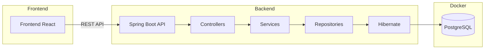
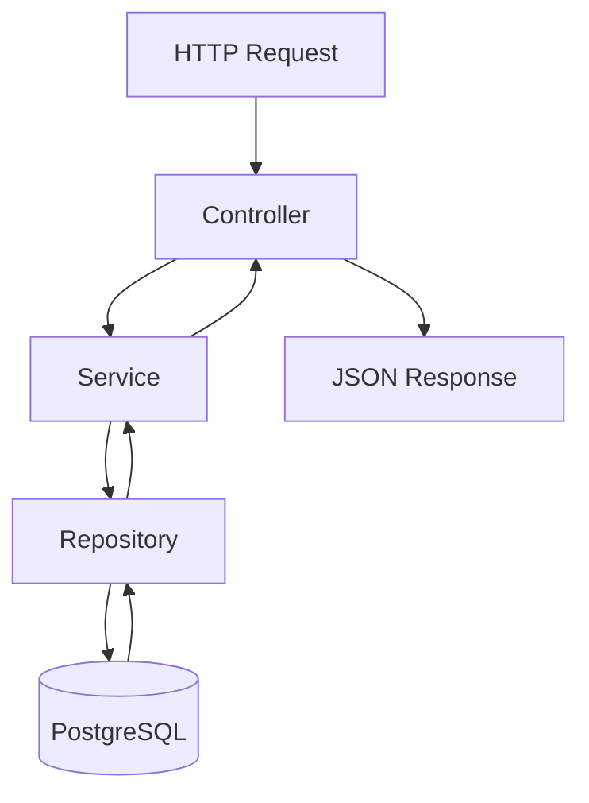
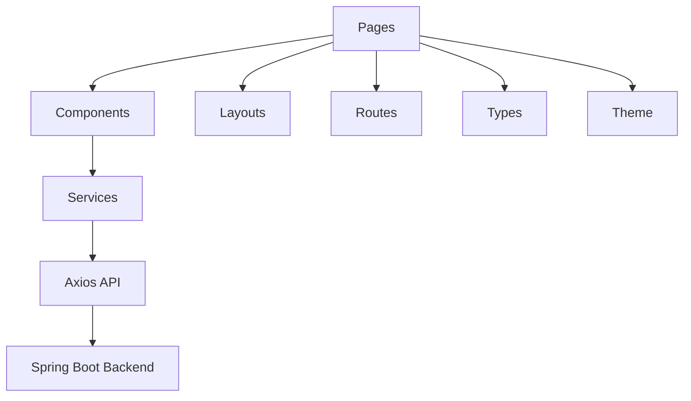
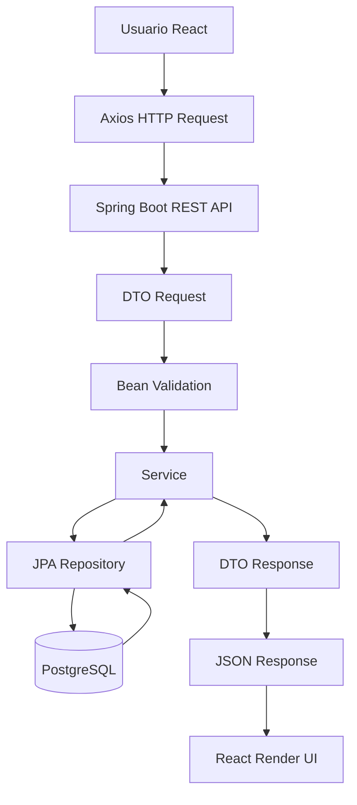
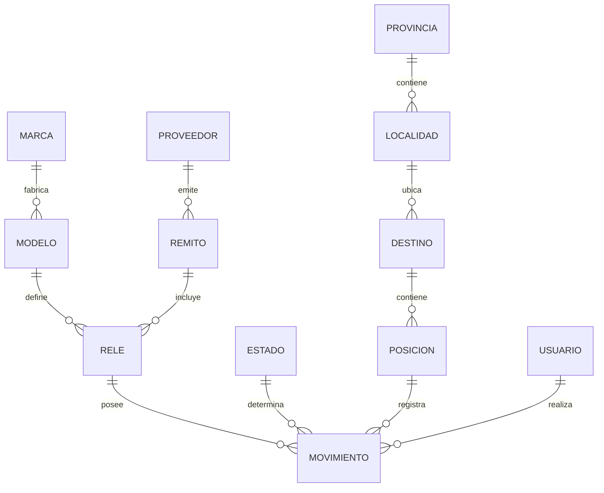

# Protecciones Trazabilidad

Sistema fullstack enterprise de gestión y trazabilidad operativa de relés de protección para EPEC Transmisión — Departamento de Teleoperaciones y Protecciones.

La aplicación permite administrar:

- relés de protección
- modelos y marcas
- movimientos operativos
- historial operativo
- estados
- posiciones
- destinos
- localidades
- provincias
- remitos
- proveedores
- usuarios responsables

mediante una arquitectura desacoplada React + Spring Boot + PostgreSQL, con autenticación JWT y control de acceso por rol.

---

# Documentación

Este `README.md` da la visión general y las instrucciones para levantar el sistema. El resto de la documentación técnica vive en `docs/`:

| Documento | Contenido |
|---|---|
| [`CLAUDE.md`](CLAUDE.md) | Referencia arquitectónica completa del sistema (raíz del repo) |
| [`docs/autenticacion.md`](docs/autenticacion.md) | Login, JWT, roles (`ADMIN`/`OPERADOR`/`AUDITOR`), flujos de autorización |
| [`docs/seguridad.md`](docs/seguridad.md) | Qué mecanismos de seguridad están implementados, por qué, y qué falta |
| [`docs/performance.md`](docs/performance.md) | Decisiones de performance tomadas y oportunidades de mejora identificadas |
| [`docs/maquina-estados.md`](docs/maquina-estados.md) | Máquina de estados operativos del Relé (estados y transiciones válidas) |
| [`docs/frontend-desarrollo.md`](docs/frontend-desarrollo.md) | Scripts, stack y convenciones específicas del frontend |

---

# Objetivo

Centralizar y digitalizar la trazabilidad operativa de:

- relés de protección
- movimientos operativos
- estados de equipos
- posiciones físicas
- destinos y ubicaciones
- historial de intervenciones
- remitos y proveedores
- usuarios responsables

El sistema busca reemplazar procesos manuales realizados previamente en Microsoft Access y servir como base para futuras integraciones corporativas:

- IBM Maximo
- APIs REST
- MIF
- dashboards operativos
- reporting técnico
- auditoría operacional

---

# Estado Actual del Proyecto

```text
Aplicación fullstack enterprise funcional
```

Actualmente el sistema ya posee:

- backend REST profesional
- frontend React desacoplado
- PostgreSQL
- Flyway
- Docker
- Material UI
- identidad visual institucional
- CRUDs operativos
- trazabilidad histórica
- catálogos dinámicos
- seed data automática
- integración React ↔ Spring Boot
- arquitectura escalable
- UX enterprise
- build frontend verificado y sin errores de compilación
- flujo operacional inspirado en el Access original del área

---

# Stack Tecnológico

## Backend

- Java 21
- Spring Boot
- Spring Data JPA
- Hibernate
- Maven
- Bean Validation

## Base de Datos

- PostgreSQL 16
- Flyway

## Frontend

- React
- TypeScript
- Vite
- Axios
- React Router DOM
- Material UI

## Infraestructura

- Docker
- Docker Compose

## API Docs

- Swagger/OpenAPI

## Seguridad

- Autenticación JWT stateless (sin sesión de servidor)
- 3 roles: `ADMIN`, `OPERADOR`, `AUDITOR`
- Passwords con BCrypt
- Rate limiting de intentos fallidos de login
- Validación de archivos adjuntos por firma binaria (no por extensión)

Detalle completo en [`docs/autenticacion.md`](docs/autenticacion.md) y [`docs/seguridad.md`](docs/seguridad.md).

---

# Arquitectura General


```mermaid
flowchart LR

    A[Frontend React]
        -->|REST API| B[Spring Boot API]

    B --> C[Controllers]
    C --> D[Services]
    D --> E[Repositories]
    E --> F[Hibernate]
    F --> G[(PostgreSQL)]

    subgraph Frontend
        A
    end

    subgraph Backend
        B
        C
        D
        E
        F
    end

    subgraph Docker
        G
    end
```

---

# Arquitectura Backend


```mermaid
flowchart TD

    A[HTTP Request]
        --> B[Controller]

    B --> C[Service]

    C --> D[Repository]

    D --> E[(PostgreSQL)]

    E --> D
    D --> C
    C --> B

    B --> F[JSON Response]
```

---

# Arquitectura Frontend


```mermaid
flowchart TD

    A[Pages]
        --> B[Components]

    B --> C[Services]

    C --> D[Axios API]

    D --> E[Spring Boot Backend]

    A --> F[Layouts]

    A --> G[Routes]

    A --> H[Types]

    A --> I[Theme]
```

---

# Flujo Fullstack Actual


```mermaid
flowchart TD

    A[Usuario React]
        --> B[Axios HTTP Request]

    B --> C[Spring Boot REST API]

    C --> D[DTO Request]

    D --> E[Bean Validation]

    E --> F[Service]

    F --> G[JPA Repository]

    G --> H[(PostgreSQL)]

    H --> G

    G --> F

    F --> I[DTO Response]

    I --> J[JSON Response]

    J --> K[React Render UI]
```

---

# Modelo Conceptual Operacional

## Concepto principal

```text
Modelo = tipo técnico de relé
Número de serie = unidad física real
```

Puede haber múltiples relés asociados al mismo modelo.

La trazabilidad y operación se realiza sobre:

```text
la unidad física
```

identificada mediante el número de serie.

---

# Arquitectura Operacional

El sistema NO se comporta como un CRUD tradicional.

Conceptualmente:

- Relés = inventario operacional
- Movimientos = eventos históricos
- Historial = trazabilidad
- Estado actual = derivado del último movimiento
- Posición actual = derivada del último movimiento

Esto permite evolucionar posteriormente hacia:

- workflows operacionales
- auditoría automática
- máquina de estados
- dashboards operativos
- integración con sistemas corporativos

---

# Modelo Relacional


```mermaid
erDiagram

    MARCA ||--o{ MODELO : fabrica

    MODELO ||--o{ RELE : define

    RELE ||--o{ MOVIMIENTO : posee

    ESTADO ||--o{ MOVIMIENTO : determina

    POSICION ||--o{ MOVIMIENTO : registra

    DESTINO ||--o{ POSICION : contiene

    LOCALIDAD ||--o{ DESTINO : ubica

    PROVINCIA ||--o{ LOCALIDAD : contiene

    PROVEEDOR ||--o{ REMITO : emite

    REMITO ||--o{ RELE : incluye

    USUARIO ||--o{ MOVIMIENTO : realiza
```

---

# Entidades Implementadas

## Catálogos

- Marca
- Estado
- Provincia
- Localidad

## Dominio Principal

- Modelo
- Rele
- Movimiento

## Ubicaciones

- Destino
- Posicion

## Gestión Logística

- Proveedor
- Remito

## Usuarios

- Usuario

---

# Gestión de Modelos

## Funcionalidades implementadas

- Alta de modelos
- Edición de modelos
- Eliminación de modelos
- Asociación Marca ↔ Modelo
- Validación de duplicados
- Métricas operativas por modelo
- Conteo de relés activos
- Conteo de relés dados de baja
- Conteo total de relés
- Visualización operacional de uso real

## Estado visual

Los modelos sin relés activos:

- continúan visibles
- aparecen visualmente atenuados
- mantienen trazabilidad histórica

---

# Gestión de Relés

## Funcionalidades implementadas

- Alta de relés
- Edición de relés
- Asociación con modelos
- Asociación logística con remitos
- Carga inteligente por remito: subís el PDF/imagen del remito y una IA (Gemini) propone los relés a cargar (marca, modelo, número de serie), quedando a confirmación del usuario antes de dar de alta
- Número de serie único
- Gestión de garantía
- Estado operacional actual
- Posición actual
- Destino actual
- Historial operativo
- Relación con movimientos
- Búsqueda por serial
- Búsqueda parcial
- Paginación
- Sorting dinámico

---

# Baja Lógica de Relés

## Funcionalidades implementadas

El sistema implementa:

```text
soft delete operacional
```

mediante:

- activo
- motivoBaja
- fechaBaja

## Beneficios

- preservación histórica
- trazabilidad completa
- integridad operacional
- protección de movimientos históricos
- auditoría futura

## Frontend

- botón "Dar de baja"
- dialog de confirmación
- motivo obligatorio
- visualización ACTIVO / BAJA
- filtros:
  - activos
  - inactivos
  - todos

## Backend

Endpoint:

```http
PATCH /api/reles/{id}/baja
```

---

# Gestión de Movimientos

## Concepto operacional

Los movimientos representan:

```text
eventos históricos operativos
```

y constituyen:

- la trazabilidad del equipo
- los cambios de estado
- los cambios de ubicación
- el historial técnico

---

# Funcionalidades implementadas

- Registro de movimientos
- Estados operativos
- Posiciones
- Destinos
- Responsable
- Fecha automática
- Notas operativas
- Historial operativo
- Orden descendente por fecha
- Timeline operacional básico
- Validación de relés activos
- Relación completa con trazabilidad física

---

# Gestión Geográfica Operacional

## Provincias

- CRUD completo
- validación de duplicados
- integridad referencial
- ordenamiento alfabético

## Localidades

- CRUD completo
- relación Localidad ↔ Provincia
- validación de duplicados por provincia
- integración con destinos

## Destinos

- CRUD completo
- relación Destino ↔ Localidad
- integración operacional
- reutilización en posiciones

## Posiciones

- CRUD completo
- relación Posición ↔ Destino
- integración directa con movimientos
- validación de duplicados por destino

---

# Gestión Logística

## Proveedores

- CRUD completo
- domicilio
- teléfono
- validaciones
- integridad referencial

## Remitos

- CRUD completo
- número de remito
- fecha
- proveedor asociado
- integración logística con relés
- validación de duplicados (en aplicación y con índice único en base de datos)
- adjunto PDF o foto (celular) del comprobante — la foto se convierte automáticamente a PDF

---

# Autenticación y Usuarios

## Funcionalidades implementadas

- Login por email o número de sobre (legajo)
- Token JWT (8hs de validez por defecto), sin cookies ni sesión de servidor
- 3 roles con permisos diferenciados:
  - **ADMIN**: lectura + escritura + gestión de usuarios
  - **OPERADOR**: lectura + escritura operativa (sin gestión de usuarios)
  - **AUDITOR**: solo lectura
- Autogestión de la propia contraseña (cualquier rol, sin depender de ADMIN)
- Bloqueo temporal tras varios intentos fallidos de login
- Soft delete de usuarios (`activo`), preservando su firma en el historial de movimientos

Detalle de flujos, diagramas y credencial de bootstrap en [`docs/autenticacion.md`](docs/autenticacion.md).

---

# APIs REST Implementadas

## Autenticación

- /api/auth/login
- /api/auth/password

## Catálogos

- /api/marcas
- /api/estados
- /api/provincias
- /api/localidades
- /api/destinos
- /api/posiciones

## Gestión logística

- /api/proveedores
- /api/remitos
- /api/remitos/analizar (carga inteligente por IA)
- /api/ordenes-provision

## Dominio principal

- /api/modelos
- /api/reles
- /api/movimientos

## Dashboard e IA

- /api/dashboard
- /api/dashboard/resumen-ia
- /api/copiloto/consultar

## Usuarios

- /api/usuarios

---

# Endpoints Avanzados

## Relés

### Obtener relés paginados

```http
GET /api/reles?page=0&size=10
```

### Sorting dinámico

```http
GET /api/reles?page=0&size=10&sort=numeroSerie,asc
```

### Buscar serial exacto

```http
GET /api/reles/serial/REL-001
```

### Buscar serial parcial

```http
GET /api/reles/buscar?serial=REL
```

### Historial de movimientos

```http
GET /api/reles/{id}/movimientos
```

### Obtener relé por ID

```http
GET /api/reles/{id}
```

### Obtener estado actual

```http
GET /api/reles/{id}/estado-actual
```

### Filtrar por estado actual

```http
GET /api/reles/estado/{estado}
```

### Opciones frontend

```http
GET /api/reles/opciones
```

### Dar de baja

```http
PATCH /api/reles/{id}/baja
```

---

# Dashboard Actual

## Métricas implementadas

- total de relés
- relés activos
- relés dados de baja
- relés instalados
- relés en stock operativo
- últimos movimientos

## Dashboard operacional

- KPIs visuales
- cards operativas
- gráficos de distribución (estado, marca, modelo, destino, proveedor)
- tabla de últimos movimientos
- métricas en tiempo real
- exportación a Excel y PDF
- resumen ejecutivo generado por IA (Gemini API, opcional — requiere `GEMINI_API_KEY`; admite varias claves separadas por coma para repartir cuota gratuita entre cuentas; se pide automáticamente al abrir el dashboard, pero el backend lo cachea 4hs, así que en la práctica solo consume cuota cuando el cache venció; un botón "Actualizar" fuerza la regeneración inmediata)
- Copiloto IA: chat que responde preguntas sobre el estado del stock y puede navegar/filtrar la interfaz por vos (ej. "mostrame los relés en reparación"), también sobre Gemini API

---

# Próximos Pasos

## Frontend

- DataGrid avanzado con virtualización (tabla de movimientos, ver `docs/performance.md`)
- filtros visuales avanzados
- timeline visual
- code splitting por ruta

## Backend / Seguridad / Performance

El backlog priorizado de mejoras técnicas ya no se lleva en este README para no desactualizarse — vive en:

- [`docs/seguridad.md`](docs/seguridad.md) (sección "Resumen — qué falta"): rate limiting detrás de proxy, política de contraseñas, headers HTTP de seguridad, logging de auditoría, dependency scanning, revocación de JWT.
- [`docs/performance.md`](docs/performance.md) (sección "Resumen — oportunidades de mejora"): índices de FK faltantes, paginación de `/api/movimientos`, N+1 puntuales, code splitting, cache/compresión de Nginx.

## Integraciones futuras

- IBM Maximo
- MIF
- APIs corporativas

---

# Ejecución con Docker (recomendado)

Levanta los tres componentes (PostgreSQL, backend, frontend) con un solo comando. Cada uno
corre en su propio contenedor, en una red que Docker Compose arma automáticamente.

## Requisitos

- Tener [Docker Desktop](https://www.docker.com/products/docker-desktop/) instalado y corriendo.
- Clonar el repositorio.

## Primera vez en esta máquina

`docker/.env` tiene las credenciales de la base y está en `.gitignore` (no se sube al repo),
así que hay que crearlo una vez por máquina a partir del ejemplo:

```bash
cd docker
cp .env.example .env
```

Podés dejar los valores por defecto de `.env.example` para desarrollo local, o cambiar
`DB_PASSWORD` si querés. Este paso solo hace falta la primera vez que clonás el proyecto
en una PC nueva (no hay que repetirlo en cada `docker compose up`).

## Levantar todo

```bash
cd docker
docker compose up -d --build
```

- `--build` reconstruye las imágenes si cambiaste código de backend o frontend. Si solo
  querés levantar lo ya construido, alcanza con `docker compose up -d`.
- Las variables de entorno (usuario/password/nombre de la base) se leen de `docker/.env`,
  el mismo archivo que ya se usaba para levantar solo Postgres.
- El backend se conecta a Postgres usando el nombre del servicio (`postgres`) como host,
  no `localhost` — así se resuelve dentro de la red interna de Docker Compose.
- Los PDF que suben Remitos/Órdenes de Provisión se guardan en un volumen nombrado
  (`uploads_data`), para que no se pierdan si se recrea el contenedor del backend.

Para bajar todo:

```bash
docker compose down
```

Para bajar todo y además borrar los datos de Postgres (⚠️ pierde todo lo cargado en la base):

```bash
docker compose down -v
```

Ver logs de un servicio puntual (útil para debuggear el arranque):

```bash
docker compose logs backend -f
docker compose logs frontend -f
```

## URLs

```text
Frontend: http://localhost:5173
Backend:  http://localhost:8080/api
Swagger:  http://localhost:8080/swagger-ui/index.html
```

---

# Producción

Pensado para un servidor dentro de la red interna de EPEC (sin dominio público). A
diferencia del `docker compose up` de desarrollo, en producción:

- Solo se expone al host un proxy nginx con TLS (puertos 80/443); backend y frontend
  dejan de publicar sus puertos directo.
- El certificado es autofirmado (no hay dominio público para validar con Let's
  Encrypt) — los navegadores van a mostrar una advertencia de "no confiable" la
  primera vez, salvo que se instale el certificado como confiable en cada máquina
  cliente.
- Corre un servicio adicional que hace un dump diario de Postgres a
  `docker/backups/` (carpeta del servidor, fuera de los volúmenes de Docker).
- El backend corre con el perfil `prod` (sin loguear SQL, logging menos verboso).

## Primera vez en el servidor

```bash
cd docker
cp .env.example .env
# Editar .env: DB_PASSWORD y JWT_SECRET propios (nunca los del ejemplo).
```

Generar el certificado autofirmado, con el hostname o IP real del servidor como CN:

```bash
cd docker/certs
./generate-self-signed.sh protecciones.epec.local   # o la IP del servidor
```

## Levantar todo

```bash
cd docker
docker compose -f docker-compose.yml -f docker-compose.prod.yml up -d --build
```

- Esta combinación de `-f` es la que hace la diferencia con el `docker compose up`
  de desarrollo: no incluye `docker-compose.override.yml` (que es el que publica
  8080/5173 directo), y sí incluye `docker-compose.prod.yml` (proxy TLS + backups +
  perfil `prod`).
- `docker compose ps` no debería listar el puerto 8080 ni 5173 publicados — solo
  `proxy` con 80/443.

Para bajar todo, agregar el mismo par de `-f` a `docker compose down`.

## Backups

Se generan solos, una vez por día, en `docker/backups/protecciones_AAAAMMDD_HHMMSS.sql.gz`
(se conservan los últimos `BACKUP_RETENTION_DIAS` días, default 14 — configurable en
`docker/.env`). Restaurar uno:

```bash
gunzip -c docker/backups/protecciones_20260721_030000.sql.gz | \
  docker compose exec -T postgres psql -U postgres -d protecciones
```

## Renovar el certificado

Cuando falte poco para que expire (825 días desde que se generó) o cambie el
hostname/IP del servidor, volver a correr `generate-self-signed.sh` y reiniciar el
proxy:

```bash
cd docker && docker compose -f docker-compose.yml -f docker-compose.prod.yml restart proxy
```

---

# Ejecución Local (sin Docker)

Alternativa para desarrollar sin reconstruir imágenes cada vez (hot reload de Vite y
devtools de Spring Boot). Requiere tener Java 21, Node y npm instalados en la máquina.

## Levantar solo PostgreSQL

```bash
cd docker
docker compose up -d postgres
```

## Ejecutar Backend

`spring.datasource.password` no tiene default: hay que setear `DB_PASSWORD` como variable
de entorno (el mismo valor que `docker/.env`) antes de levantar el backend.

PowerShell (carga las variables de `docker/.env` automáticamente):

```powershell
cd backend
./run-dev.ps1
```

Manual:

```powershell
cd backend
$env:DB_PASSWORD="9988776655"
./mvnw.cmd spring-boot:run
```

## Ejecutar Frontend

```bash
cd frontend
npm install
npm run dev
```

## Verificar compilación frontend

```bash
cd frontend
npm run build
```

---

# Tests y CI

```bash
cd backend
./mvnw test        # tests backend (JUnit + Testcontainers, levantan su propio Postgres)

cd frontend
npm run test        # tests frontend (Vitest + Testing Library)
npm run lint         # ESLint (no bloqueante en CI por errores preexistentes, ver docs/frontend-desarrollo.md)
```

El workflow de GitHub Actions (`.github/workflows/ci.yml`) corre ambas suites en cada push y en los PRs contra `main`, además del build de producción del frontend.

---

## Frontend

```text
http://localhost:5173
```

## Swagger

```text
http://localhost:8080/swagger-ui/index.html
```

---

# Autor

Proyecto desarrollado como iniciativa de modernización y digitalización operativa para el área de Protecciones y Teleoperación de EPEC Transmisión.