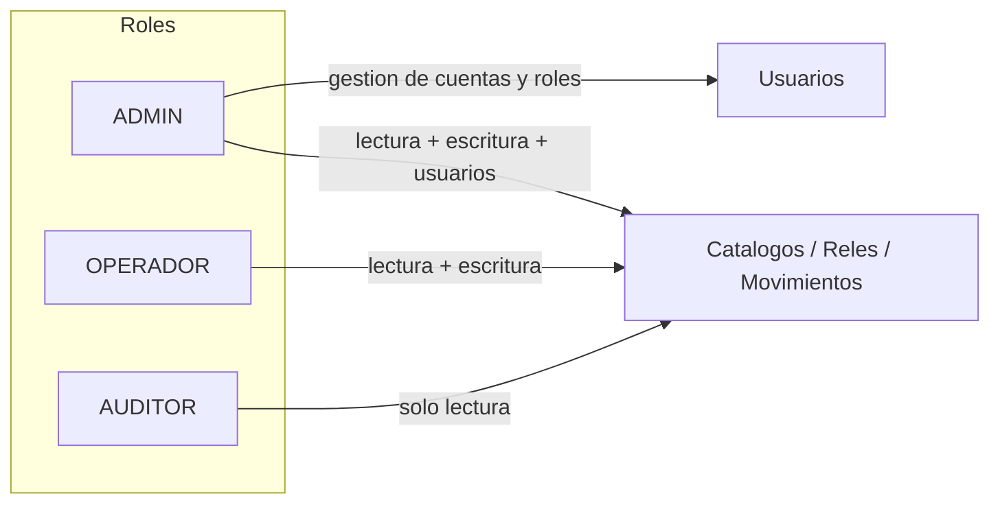
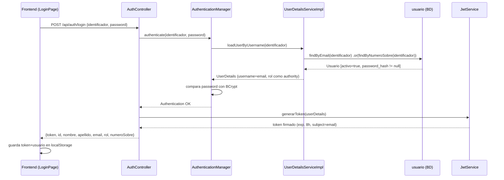
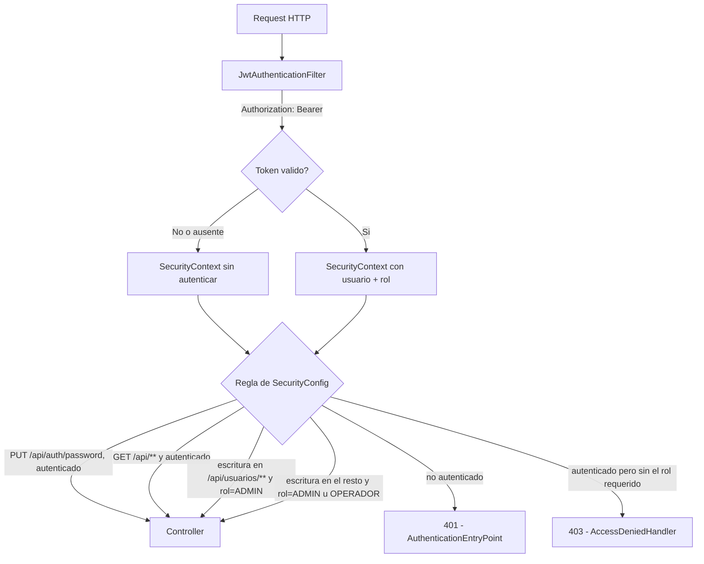
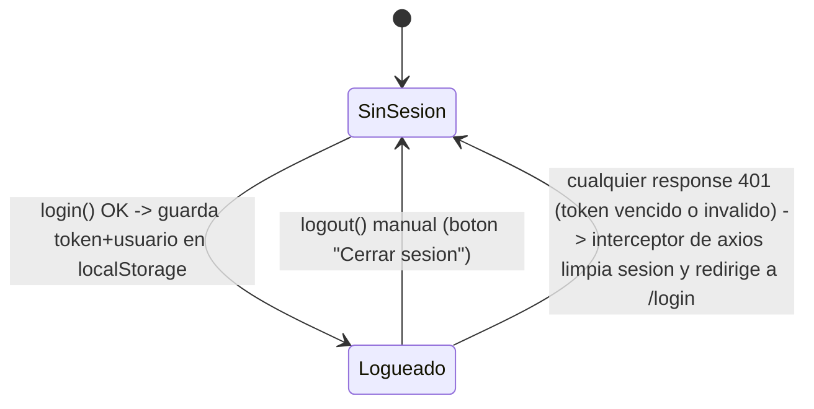
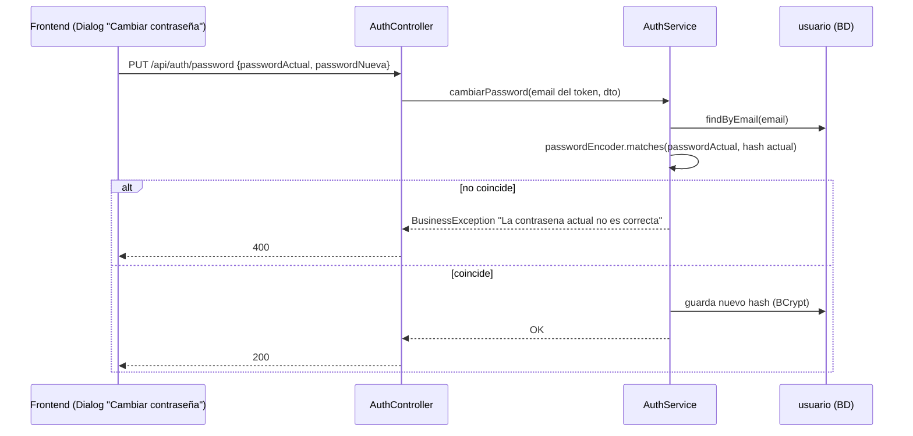

# Autenticación y autorización

Documento de referencia sobre el sistema de login del proyecto (implementado en `V27__add_autenticacion_a_usuario.sql`, ampliado en `V28__add_operador_y_numero_sobre_a_usuario.sql`). Complementa al `CLAUDE.md` raíz, que resume el estado general del sistema.

---

## 1. Estrategia

- **JWT stateless** vía header `Authorization: Bearer <token>`. No hay sesión ni cookies del lado del servidor.
- El login se identifica por **email o número de sobre (legajo)** — ambos únicos (columnas `usuario.email` y `usuario.numero_sobre`).
- El token se firma con `JWT_SECRET` (variable de entorno, con default solo para desarrollo — ver `application.properties` y `docker/.env.example`) y expira a las `JWT_EXPIRATION_MS` (default: 8 horas, la duración de un turno). Internamente el JWT siempre usa el **email** como subject, sin importar con qué identificador se logueó la persona.
- No hay refresh token: al expirar, el usuario vuelve a loguearse. No hay recuperación de contraseña por email — en cambio, cualquier usuario logueado puede cambiar su propia contraseña (ver sección 7).

## 2. Roles

Se definieron **3 roles**:

| Rol | Lectura (`GET`) | Escritura en catálogos/relés/movimientos | Gestión de usuarios (`/api/usuarios`) |
|---|---|---|---|
| `ADMIN` | Sí | Sí | Sí (único rol que puede) |
| `OPERADOR` | Sí | Sí | No |
| `AUDITOR` | Sí | No | No |

`ADMIN` es el superusuario (sin cambios respecto a la versión inicial): controla todo, incluida la creación/edición de cuentas y la asignación de roles. `OPERADOR` se agregó para separar el trabajo operativo diario (relés, movimientos, catálogos) de la gestión de usuarios, que debe quedar exclusiva de `ADMIN`. `AUDITOR` no cambió: solo lectura en todo el sistema, incluida la vista de usuarios.

La regla de autorización sigue **centralizada** en `SecurityConfig` (backend), no dispersa por controller, pero ya no es binaria:

- `PUT /api/auth/password` → cualquier rol autenticado (autogestión, no requiere ser `ADMIN`).
- Cualquier `GET /api/**` → accesible para los 3 roles autenticados.
- Cualquier otro método sobre `/api/usuarios/**` → solo `ADMIN`.
- Cualquier otro método sobre el resto de `/api/**` → `ADMIN` u `OPERADOR`.

## 3. Modelo de datos

`usuario` (ampliada en `V27` y `V28`):

| Columna | Notas |
|---|---|
| `password_hash` | BCrypt. `NULL` para el usuario "sistema" (id=1) — no puede loguearse, se conserva solo por integridad referencial de movimientos históricos. |
| `rol` | `'ADMIN'` \| `'OPERADOR'` \| `'AUDITOR'`, `CHECK` en BD + validado en `UsuarioService`. |
| `activo` | Permite deshabilitar el login de una persona sin romper el historial de `Movimiento.usuario_id` (mismo patrón de soft-delete que `Rele.activo`). |
| `numero_sobre` | Legajo interno de EPEC. `NOT NULL UNIQUE` a nivel BD (mismo patrón que `Rele.numeroSerie`), obligatorio y único para **todo** usuario, incluidos los preexistentes. |

⚠️ **Los usuarios creados antes de `V28`** (`admin@epec.local`, `sistema@local`, y cualquier otro dado de alta con la primera versión) recibieron un **placeholder** en `numero_sobre` igual a su propio `id` (`"1"`, `"2"`, `"3"`...) porque la migración no conoce el legajo real de nadie. Hay que corregirlo por el legajo verdadero desde `/admin/usuarios` (`ADMIN` → Editar) apenas se sepa.

## 4. Flujo de login

`identificador` acepta indistintamente el email o el número de sobre — `UserDetailsServiceImpl` prueba primero por email y, si no encuentra, por `numeroSobre`. Si ninguno matchea, el usuario está inactivo, no tiene contraseña (caso "sistema"), o la contraseña no coincide, `AuthService.login` devuelve un `BusinessException` genérico ("Email o contraseña incorrectos") — no se distingue el motivo exacto, para no filtrar qué cuentas existen.

## 5. Flujo de autorización por request

Tanto el `AuthenticationEntryPoint` (401) como el `AccessDeniedHandler` (403) devuelven el mismo shape JSON que el resto de los errores de negocio (`{"message": "...", "status": 401|403}`, ver `exception/ErrorResponse.java`), para que el frontend siga usando su patrón existente `err.response?.data?.message` sin código especial para estos casos.

## 6. Ciclo de vida de la sesión en el frontend

El interceptor de request de `frontend/src/api/axios.ts` agrega el header `Authorization` en cada llamada si hay token guardado. El de response detecta cualquier `401` y fuerza logout + redirección a `/login`.

En la UI, `AuthContext` expone dos flags derivados del rol:
- `isAdmin` (`rol === "ADMIN"`) — gatea exclusivamente el menú y el CRUD de `/admin/usuarios`.
- `canWrite` (`rol === "ADMIN" || rol === "OPERADOR"`) — gatea el resto de la escritura (crear/editar/eliminar relés, movimientos, catálogos).

La autoridad real siempre es el backend (una petición de escritura forzada por devtools recibe igual 401/403 según corresponda) — la UI solo oculta lo que el rol actual no puede hacer.

## 7. Gestión de usuarios y autogestión de contraseña

- **Alta/edición de cuentas**: exclusiva de `ADMIN`, desde `/admin/usuarios` (`UsuarioController`). No hay `DELETE`: para retirarle acceso a alguien se edita su usuario y se desmarca "Activo", lo que además de bloquear el login preserva su firma en el historial de movimientos ya registrados.
- **Cambio de la propia contraseña**: cualquier usuario logueado (los 3 roles) puede cambiarla desde el ícono de llave en la barra superior (`MainLayout`), sin depender de `ADMIN`. `PUT /api/auth/password` requiere la contraseña actual (`AuthService.cambiarPassword` valida con `PasswordEncoder.matches`) y no exige ningún rol específico — solo estar autenticado.

## 8. Credencial de bootstrap

La migración `V27` crea un único usuario `ADMIN` inicial para poder entrar por primera vez:

- Email: `admin@epec.local` (número de sobre placeholder: `"2"`, ver sección 3)
- Contraseña temporal: `EpecAdmin2026!`

**Cambiar esta contraseña** (desde el ícono de llave apenas logueado, o editando el usuario desde `/admin/usuarios`) antes de cualquier uso real fuera de un entorno de desarrollo local. Ídem con el número de sobre placeholder.

## 9. Limitaciones conocidas (fuera de alcance de esta versión)

- Sin refresh token: la sesión expira a las 8h y hay que volver a loguearse.
- Sin recuperación de contraseña "olvidé mi contraseña" (solo autogestión estando ya logueado).
- Sin 2FA.
- Sin bloqueo por intentos fallidos de login.

Cualquiera de estos puntos es una extensión aislada sobre lo ya construido, no un rediseño.
