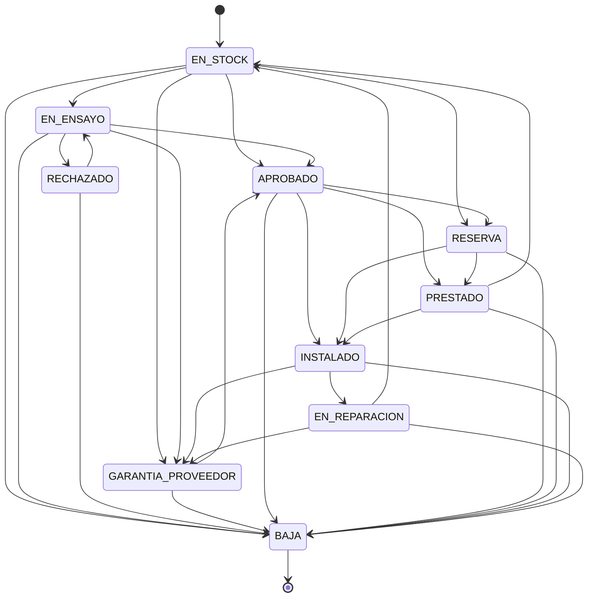

# Máquina de estados operativos del Relé

Documento de referencia exclusivo sobre la máquina de estados de `Rele` (catálogo `estado` + `transicion_estado`). Complementa al `CLAUDE.md` raíz, que resume el estado general del sistema.

> ⚠️ **Estado de este documento**: describe el diseño **acordado e implementado** de la máquina de estados (definido y migrado el 2026-07-21). La migración `V33__redefinir_maquina_estados.sql` reemplaza a `V20__actualizar_transiciones_estado.sql` como fuente de verdad del esquema; la sección 6 queda como registro histórico del diff respecto a `V20`. Falta que `V33` se aplique efectivamente sobre cada base de datos existente (se aplica sola al levantar el backend, vía Flyway).

---

## 1. Por qué existe esta máquina de estados

El sistema reemplaza un proceso manual llevado en Access (`docs/Procedimiento Trazabilidad Protecciones - 1º propuesta.pdf`). Ese proceso mezclaba en un solo campo "Estado" tanto la condición operativa del relé (en ensayo, aprobado, de baja...) como su destino físico (Trafo, obra, laboratorio...). En este sistema el destino físico ya lo modela `Destino`/`Posicion` en cada `Movimiento`, así que el estado se redujo a representar **solo la condición operativa** del relé — evitando duplicar en el estado algo que ya vive en otro campo.

Reglas invariantes (no repetidas aquí, ver `CLAUDE.md`):
- El estado actual de un relé es siempre el estado del **último `Movimiento`** (nunca un campo propio de `Rele`).
- Las transiciones válidas se validan siempre contra la tabla `transicion_estado`, nunca hardcodeadas en Java.
- Agregar/quitar un estado o una transición es un cambio de **datos** (migración Flyway), no de código.

## 2. Estados

Convención de nombres: `SNAKE_CASE_MAYÚSCULA` para todos (elimina la inconsistencia actual, donde conviven `EN STOCK`, `EN_SERVICIO` y `EN REPARACION` con separadores distintos).

| Estado | Tipo | Descripción |
|---|---|---|
| `EN_STOCK` | inicial | Disponible en depósito, sin asignar a ningún destino. Es el estado que recibe todo relé al darse de alta (primer `Movimiento` automático). |
| `EN_ENSAYO` | intermedio | En pruebas técnicas antes de aprobarse para uso. |
| `RECHAZADO` | intermedio | No cumple la especificación técnica (PDCG) o el ensayo no se aprobó. Puede reclamarse al proveedor y reintentar ensayo, o darse de baja. |
| `GARANTIA_PROVEEDOR` | intermedio | Enviado al proveedor por reclamo de garantía. |
| `APROBADO` | intermedio | Ensayo aprobado (o garantía resuelta favorablemente), apto para instalar, reservar o prestar. |
| `RESERVA` | intermedio | Asignado a un destino futuro, aún no instalado físicamente. Es un estado genérico (no distingue "repuesto de obra" de "reservado para un equipo puntual" — ver sección 7). |
| `PRESTADO` | intermedio | Cedido temporalmente (p. ej. laboratorio para pruebas de funciones nuevas), sin instalación definitiva. Se espera que vuelva. |
| `INSTALADO` | intermedio | Instalado y operativo en su destino final. (Antes `EN_SERVICIO` — renombrado por ser más intuitivo para el usuario final). |
| `EN_REPARACION` | intermedio | En reparación interna del área. |
| `BAJA` | terminal | Retirado definitivamente (soft delete: `Rele.activo = false`). No admite más movimientos. |

## 3. Diagrama de transiciones

## 4. Tabla de transiciones (para revisión rápida / migración)

| Origen | Destinos permitidos |
|---|---|
| `EN_STOCK` | `EN_ENSAYO`, `GARANTIA_PROVEEDOR`, `APROBADO`, `RESERVA`, `BAJA` |
| `EN_ENSAYO` | `APROBADO`, `RECHAZADO`, `GARANTIA_PROVEEDOR`, `BAJA` |
| `RECHAZADO` | `EN_ENSAYO`, `BAJA` |
| `GARANTIA_PROVEEDOR` | `APROBADO`, `BAJA` |
| `APROBADO` | `INSTALADO`, `RESERVA`, `PRESTADO`, `BAJA` |
| `RESERVA` | `INSTALADO`, `PRESTADO`, `BAJA` |
| `PRESTADO` | `INSTALADO`, `EN_STOCK`, `BAJA` |
| `INSTALADO` | `EN_REPARACION`, `GARANTIA_PROVEEDOR`, `BAJA` |
| `EN_REPARACION` | `EN_STOCK`, `GARANTIA_PROVEEDOR`, `BAJA` |
| `BAJA` | *(terminal, sin salidas)* |

## 5. Estado inicial y estado terminal

- **Estado inicial**: `EN_STOCK`. `ReleService.guardar` crea automáticamente el primer `Movimiento` en este estado al dar de alta un relé.
- **Estado terminal**: `BAJA`. Una vez alcanzado, `Rele.activo` pasa a `false` y `MovimientoService.guardar` rechaza cualquier operación posterior sobre ese relé (`ver ReleBajaService.aplicarBaja`).

## 6. Diferencias respecto a lo que estaba implementado antes (`V20`, registro histórico)

| Cambio | Detalle |
|---|---|
| Renombres | `EN STOCK` → `EN_STOCK`, `EN REPARACION` → `EN_REPARACION`, `ENSAYO` → `EN_ENSAYO`, `EN_SERVICIO` → `INSTALADO` (unifica separador y hace el nombre más intuitivo) |
| Estado nuevo | `RECHAZADO` (no existía; hoy un ensayo no aprobado va directo a `BAJA`) |
| Estado nuevo | `PRESTADO` (no existía; hoy no hay forma de representar un préstamo temporal distinto de una instalación definitiva) |
| Transición nueva | `EN_ENSAYO → RECHAZADO` |
| Transición nueva | `RECHAZADO → EN_ENSAYO` y `RECHAZADO → BAJA` |
| Transición nueva | `APROBADO → PRESTADO`, `RESERVA → PRESTADO`, `PRESTADO → INSTALADO`, `PRESTADO → EN_STOCK`, `PRESTADO → BAJA` |
| Transición nueva | `INSTALADO → GARANTIA_PROVEEDOR` (hoy un relé instalado que falla no puede pasar directo a reclamo de garantía) |
| Transición nueva | `EN_REPARACION → GARANTIA_PROVEEDOR` (hoy una reparación que resulta ser un caso de garantía no puede derivar ahí directamente) |
| Limpieza pendiente | Estados huérfanos sin uso en `transicion_estado` (p. ej. `INSTALADO` viejo de `V5`, `INGRESADO` referenciado en `V15` sin insert correspondiente) y `case` muertos en frontend (`ReleTable.tsx`, `ReleDetailPage.tsx`) que referencian nombres que nunca matchean (`"REPARACION"`, `"INSTALADO"` del sentido viejo, `"SIN HISTORIAL"`) |

**Implementado**: migración `V33__redefinir_maquina_estados.sql` + actualización de los mapas de color/label en `HomePage.tsx`, `ReleTable.tsx`, `ReleDetailPage.tsx`, `ReleAltaWizard.tsx`, `PasoDatosLote.tsx`, `InicioPage.tsx` y de los services/tests de backend que comparaban contra el nombre literal del estado.

## 7. Decisiones de diseño registradas

- **`RESERVA` se mantiene genérico** (no se separan "repuesto de obra" vs. "reservado para un equipo puntual" como en Access) — decisión explícita para no sobre-modelar; si en el futuro hace falta distinguirlo, es un cambio de datos aislado (agregar el estado + sus transiciones), no un rediseño.
- **`RECHAZADO` no es terminal**: puede volver a `EN_ENSAYO` (si el reclamo al proveedor deriva en un reemplazo/corrección que se vuelve a ensayar) o pasar a `BAJA` (si se desestima definitivamente).
- **`PRESTADO` puede volver a `EN_STOCK`**: un préstamo (p. ej. a laboratorio) puede terminar sin instalación, y el relé vuelve a quedar disponible.
- **No se trajo de Access** el estado `Trafo` ni la variante de destino específico como *estado* — esa información la captura mejor `Destino`/`Posicion`/`Notas` del movimiento, evitando duplicar "para qué es" en dos lugares distintos.
- **`INSTALADO` reemplaza a `EN_SERVICIO`** por ser un nombre más intuitivo para el usuario final del sistema (Departamento de Teleoperaciones y Protecciones), sin cambio de significado.

## 8. Mapeo con los estados históricos de Access

| Estado en Access | Equivalente en este sistema |
|---|---|
| `Ingresado` | `EN_STOCK` |
| `En ensayo` | `EN_ENSAYO` |
| `Rechazado` | `RECHAZADO` |
| `Garantía Proveedor` | `GARANTIA_PROVEEDOR` |
| `Aprobado` | `APROBADO` |
| `Trafo` | *(no es un estado — se modela como `Destino`/`Posicion`)* |
| `Repuesto obra` / `Reservado` | `RESERVA` (unificado) |
| `Prestado` | `PRESTADO` |
| `Entrega` / `En servicio` | `INSTALADO` (unificado) |
| `Baja` | `BAJA` |
