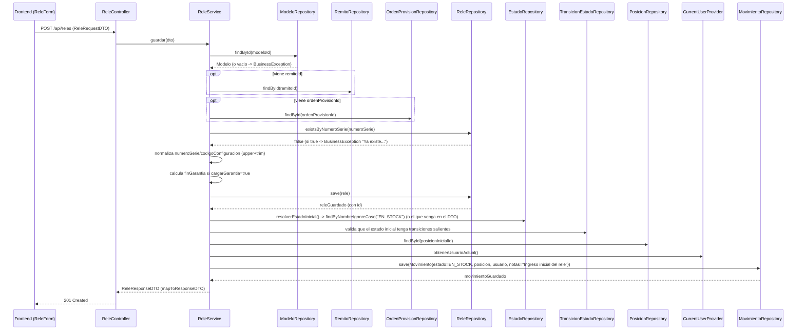
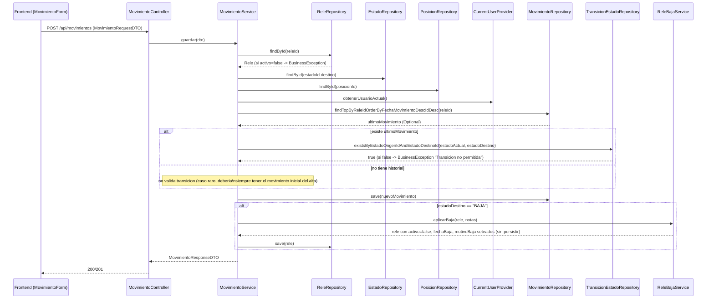
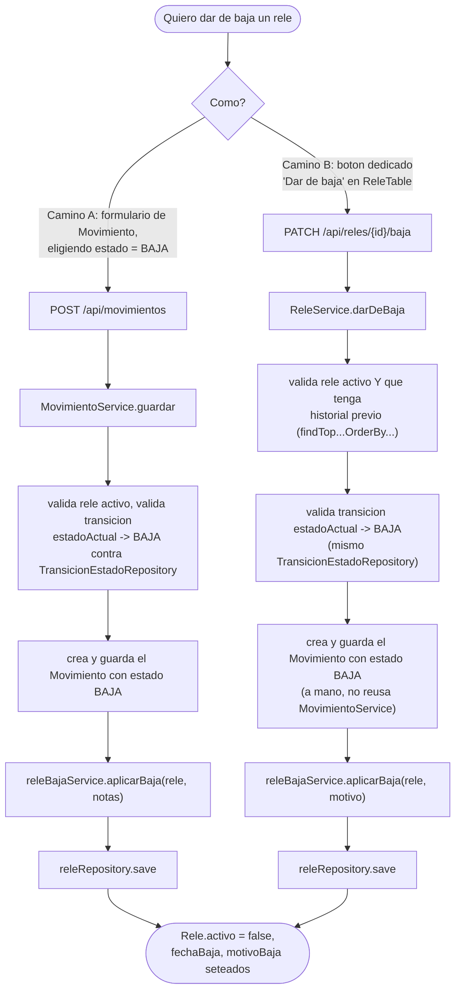
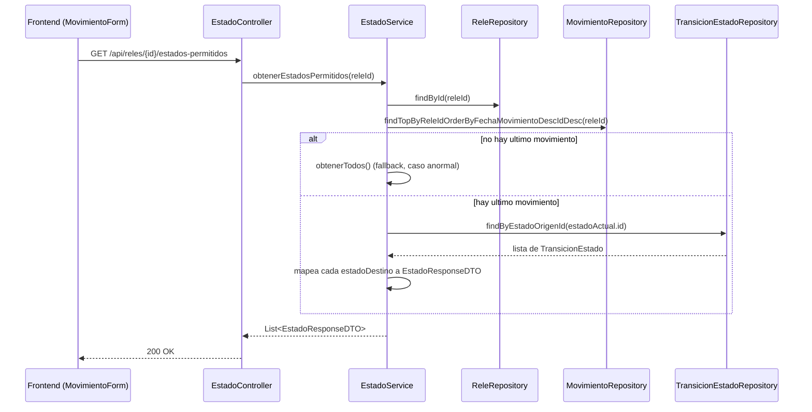
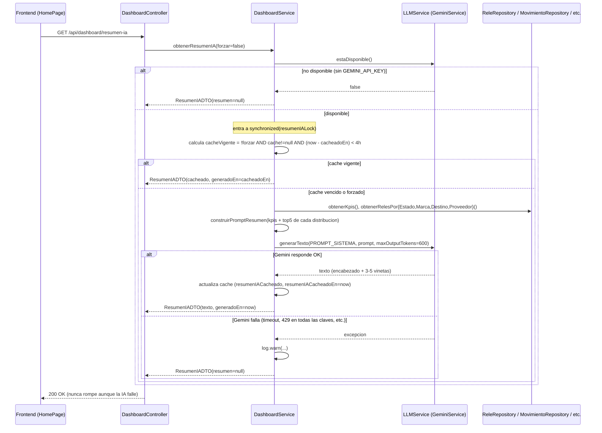
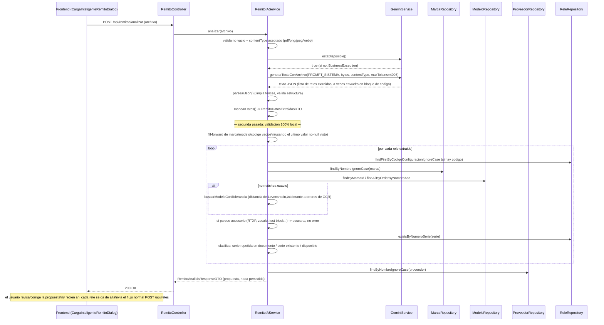

# Módulos críticos del sistema — cómo funcionan por dentro

Documento pensado para entender, módulo por módulo, **qué hace cada capa** (Controller → Service → Repository → Entity/BD) en los flujos más importantes del sistema. No repite lo que ya está en `docs/maquina-estados.md` (detalle de estados/transiciones) ni en `docs/autenticacion.md` (login/JWT/roles) — para esos dos temas, ver esos documentos. Acá el foco es: dado un flujo de negocio, **quién hace qué** y en qué orden.

Todo lo que sigue está verificado contra el código real (no es un resumen de memoria), así que los nombres de método/línea son los que vas a encontrar si abrís el archivo.

---

## 0. Cómo leer los diagramas — el patrón de capas

Antes de entrar a cada módulo, la regla general que se repite en **todos** ellos (es la Regla 1-4 de `CLAUDE.md`):

```mermaid
flowchart LR
    FE[Frontend\nReact] -- HTTP/JSON --> C[Controller\n@RestController]
    C -- "delega, sin logica propia" --> S[Service\n@Service]
    S -- "valida, calcula, orquesta" --> R[Repository\nSpring Data JPA]
    R -- Hibernate --> DB[(PostgreSQL)]
    S -- "mapea Entity -> DTO" --> C
    C -- DTO --> FE
```

- **Controller**: traduce HTTP ↔ objetos Java. Recibe un `RequestDTO` (ya validado por Bean Validation vía `@Valid`), llama **un solo método** del Service, devuelve el `ResponseDTO` o un `ResponseEntity`. Si ves un `if` con lógica de negocio en un Controller de este proyecto, es una anomalía, no el patrón.
- **Service**: acá vive el 100% de la lógica de negocio — validaciones, cálculos, orquestación entre repositorios, decisiones ("¿esta transición está permitida?", "¿ya existe este número de serie?"). También hace el mapeo `Entity → DTO` (métodos privados `mapToResponseDTO`/`mapToDTO`).
- **Repository**: interfaces Spring Data JPA. Solo saben hacer consultas (`findBy...`, `existsBy...`); no tienen ninguna decisión de negocio.
- **Entity**: el mapeo 1:1 con la tabla. No contiene lógica, son getters/setters.

Con esa grilla en la cabeza, cada diagrama de acá abajo es básicamente "quién le pasa la pelota a quién, y qué decisión toma en el camino".

---

## 1. Alta de un Relé

**Dispara**: `POST /api/reles` → `ReleController.guardar` → `ReleService.guardar` (`ReleService.java`, líneas 138-355).

Es el flujo fundacional del sistema: no solo crea el registro `Rele`, sino que le da su primer estado y posición (recordá la regla de oro: **un relé sin movimientos es un estado inconsistente**).



**Puntos clave para entender el "por qué"**:
- El orden de validaciones importa: primero se valida que las referencias (Modelo, Remito, OrdenProvision) existan, **después** se valida el número de serie duplicado. Si cualquiera falla, no se llega a tocar la base con un `save`.
- El `Movimiento` inicial **no lo pide el usuario explícitamente como "movimiento"** — el `ReleForm` del frontend solo pide una posición inicial, y el Service arma el movimiento completo por su cuenta. Por eso, si mañana agregás un campo al alta de relé, probablemente no toca `MovimientoService` para nada — todo pasa dentro de `ReleService.guardar`.
- `CurrentUserProvider.obtenerUsuarioActual()` es el mecanismo que reemplazó al viejo hardcode de "usuario sistema (id=1)" — cualquier Service que necesite "quién hizo esto" pasa por ahí.

---

## 2. Movimiento operativo (mover un relé de estado/posición)

**Dispara**: `POST /api/movimientos` → `MovimientoController.guardar` → `MovimientoService.guardar` (`MovimientoService.java`, líneas 90-220).

Este es el corazón de la trazabilidad: acá se valida la máquina de estados (ver `docs/maquina-estados.md` para el detalle de qué transiciones existen).



**Punto clave**: `ReleBajaService.aplicarBaja` **no persiste nada por sí solo** — solo setea los tres campos en el objeto `Rele` en memoria. Quien lo llama (acá `MovimientoService`) es responsable del `save`. Esto es fácil de olvidar si escribís un tercer camino de baja en el futuro: si llamás a `aplicarBaja` y no hacés `releRepository.save(rele)` después, el cambio se pierde silenciosamente (no hay excepción, simplemente no se persiste — Hibernate no tiene dirty-checking automático fuera de una transacción activa con el objeto ya adjunto).

---

## 3. Baja de un Relé — los dos caminos (y por qué están duplicados)

Acá es donde vale la pena entender bien la arquitectura, porque **hay dos caminos que llegan al mismo resultado por rutas de código distintas**, y es el ejemplo más claro de "duplicación de lógica entre dos Services" que tiene el proyecto hoy.



**Diferencias reales entre A y B** (no cosméticas):
| | Camino A (`MovimientoService.guardar`) | Camino B (`ReleService.darDeBaja`) |
|---|---|---|
| Endpoint | `POST /api/movimientos` | `PATCH /api/reles/{id}/baja` |
| DTO de entrada | `MovimientoRequestDTO` (estadoId, posicionId, notas) | `BajaReleRequestDTO` (solo `motivo`) |
| Exige historial previo | No lo chequea explícitamente (asume que siempre hay al menos el movimiento de alta) | Sí, explícito: si no hay ningún movimiento, error |
| Posición del movimiento de baja | La que elija el usuario en el form | Siempre la misma que el último movimiento (no se puede cambiar posición al dar de baja por acá) |
| Motivo/notas | `dto.getNotas()` | `dto.getMotivo()` |

`ReleBajaService.aplicarBaja` en sí es trivial (3 líneas: `activo=false`, `fechaBaja=now()`, `motivoBaja=motivo`) y es el único pedazo de código realmente compartido entre los dos caminos. Todo lo demás — la búsqueda del relé, la validación de transición, la creación del `Movimiento` — está escrito dos veces. **Si algún día cambiás una regla de la baja (por ejemplo, qué se valida antes de permitirla), tenés que tocar los dos lugares** o vas a dejarlos inconsistentes (está anotado como recordatorio en `CLAUDE.md`, sección "Buenas prácticas").

---

## 4. Estados permitidos (lo que arma el selector del frontend)

**Dispara**: `GET /api/reles/{id}/estados-permitidos` → `EstadoService.obtenerEstadosPermitidos` (`EstadoService.java`, líneas 116-171).

Este endpoint no cambia nada — es de solo lectura — pero es la pieza que hace que el usuario, en el formulario de Movimiento, solo vea como opciones los estados a los que realmente puede pasar el relé (aunque la validación **real y autoritativa** sigue viviendo en `MovimientoService.guardar`, como viste arriba: esto es solo UX, no seguridad).



---

## 5. Resumen ejecutivo del Dashboard (IA)

**Dispara**: `GET /api/dashboard/resumen-ia?forzar=false` → `DashboardService.obtenerResumenIA` (`DashboardService.java`, líneas 261-337). El frontend (`HomePage.tsx`) lo pide solo al montar el dashboard, sin forzar — el cache de 4 horas hace que la mayoría de esos pedidos no le peguen a Gemini.

Este módulo es interesante porque mete dos conceptos que no aparecen en los flujos de arriba: **cache en memoria con TTL** y **sincronización explícita** para no pagar de más una API externa.



**Por qué el `synchronized`**: si dos personas abren el dashboard al mismo tiempo justo cuando el cache venció, sin el lock las dos dispararían un llamado a Gemini en paralelo (gastando el doble de cuota gratuita para el mismo resultado). Con el lock, la segunda espera a que la primera termine y reusa el cache que la primera acaba de dejar. Es el mismo patrón que conviene usar para **cualquier integración externa cacheable** que agregues a futuro (ver la guía en `CLAUDE.md`, sección "Buenas prácticas").

---

## 6. Carga inteligente de relés por Remito (IA multimodal)

**Dispara**: `POST /api/remitos/analizar` (multipart, PDF o foto) → `RemitoIAService.analizar` (`RemitoIAService.java`, línea 223). Disparado desde `CargaInteligenteRemitoDialog.tsx` dentro de `ReleForm.tsx`.

Esto es lo más elaborado del sistema en cuanto a lógica de Service, así que vale la pena separarlo en dos partes: (a) lo que le pide al modelo de IA, y (b) lo que valida localmente con el resultado — **la IA nunca decide sola, siempre hay una segunda pasada de validación en Java contra la base real**.



**El detalle que importa**: mirá que en todo `RemitoIAService` no hay un solo `.save(...)`. Todos los repositorios se usan solo para **leer y contrastar** lo que dijo la IA contra la base real (¿existe esa marca?, ¿existe ya esa serie?, ¿el modelo se parece a uno que ya tenemos aunque el OCR lo haya deformado?). El alta de verdad la hace `ReleService.guardar` — el mismo método del punto 1 — cuando el usuario confirma. Esto es intencional: la IA propone, el flujo normal (con todas sus validaciones ya vistas) es el único que efectivamente escribe.

---

## 7. Copiloto IA del Dashboard

**Dispara**: `POST /api/copiloto/consultar` → `CopilotoIAService.consultar` (`CopilotoIAService.java`, línea 145). Componente frontend: `CopilotoIACard.tsx`.

La particularidad acá es que la respuesta del modelo puede significar dos cosas distintas para el frontend, y el Service es el que decide cuál — **nunca deja pasar una acción que no esté en una whitelist fija**.

```mermaid
sequenceDiagram
    participant FE as Frontend (CopilotoIACard)
    participant CC as CopilotoController
    participant CIS as CopilotoIAService
    participant DS as DashboardService
    participant LLM as LLMService (GeminiService)

    FE->>CC: POST /api/copiloto/consultar {mensaje}
    CC->>CIS: consultar(dto)
    CIS->>LLM: estaDisponible()
    LLM-->>CIS: true (si no, BusinessException)
    CIS->>DS: obtenerKpis(), obtenerRelesPor{Estado,Marca,Modelo,Destino,Proveedor}(),\nobtenerUltimosMovimientos(hoy) + obtenerUltimosMovimientos(ultimos 20)
    DS-->>CIS: contexto (KPIs + distribuciones completas + movimientos recientes)
    CIS->>LLM: generarTexto(PROMPT_SISTEMA, contexto + mensaje del usuario, maxTokens=700)
    LLM-->>CIS: texto (posible JSON de accion, o texto libre/markdown)
    CIS->>CIS: quitarBloqueCodigo() + intenta parsear como JSON
    alt es JSON con "accion" valida
        CIS->>CIS: validarYMapearAccion() contra whitelist\n(FILTRAR_RELES / ABRIR_RELE / IR_A_MODULO)
        CIS-->>CC: CopilotoConsultaResponseDTO(tipo="ACCION", accion=...)
    else JSON con accion desconocida o campos faltantes
        CIS-->>CC: tipo="RESPUESTA" (pide reformular)
    else no es JSON
        CIS-->>CC: tipo="RESPUESTA" (texto/markdown tal cual)
    end
    CC-->>FE: 200 OK
    Note over FE: si tipo=ACCION, el frontend navega/filtra;\nsi tipo=RESPUESTA, se renderiza como markdown
```

**Por qué la whitelist importa tanto acá**: el Copiloto es el único módulo del sistema donde una respuesta de un LLM (que en principio podría "alucinar" cualquier cosa) tiene el poder de mover al usuario por la aplicación. La whitelist (`ACCIONES_VALIDAS` y `MODULOS_VALIDOS`, constantes dentro de `CopilotoIAService`) es la barrera que garantiza que, pase lo que pase en la respuesta del modelo, lo único que puede pasar en el frontend es una navegación/filtro predefinido — nunca, por ejemplo, un borrado o un cambio de estado. Esa restricción está en el Service, no en el Controller ni en el frontend, así que aunque el frontend tuviera un bug, el backend jamás devolvería una acción fuera de esas tres.

---

## 8. Tabla resumen — "¿quién hizo esa validación?"

Para consulta rápida cuando estés leyendo un flujo y no te acuerdes en qué capa buscar:

| Pregunta | Vive en |
|---|---|
| ¿Existe el Modelo/Remito/OrdenProvision referenciado? | Service (`ReleService.guardar`) |
| ¿El número de serie ya existe? | Service (`ReleService.guardar`, vía `ReleRepository.existsByNumeroSerie`) |
| ¿La transición de estado A→B está permitida? | Service, contra `TransicionEstadoRepository` (nunca hardcodeado) |
| ¿Cuál es el estado/posición "actual" de un relé? | Derivado en el Service, buscando el último `Movimiento` (`findTopBy...OrderByFechaMovimientoDescIdDesc`) — nunca un campo propio de `Rele` |
| ¿Quién es el usuario que hizo la acción? | `CurrentUserProvider.obtenerUsuarioActual()`, inyectado en el Service |
| ¿Se puede loguear con este email/rol? | `SecurityConfig` + `JwtAuthenticationFilter` (antes de llegar al Controller) — ver `docs/autenticacion.md` |
| ¿El archivo adjunto es realmente un PDF/foto válida? | `ArchivoAdjuntoValidator`, invocado desde el Service (`RemitoService`/`OrdenProvisionService`) |
| ¿Vale la pena llamar a Gemini de nuevo o uso el cache? | Service (`DashboardService`, con lock) |
| ¿Esta acción del Copiloto es segura de ejecutar? | Service (`CopilotoIAService`, contra whitelist fija) |

La regla que resume todo el documento: **si estás buscando una decisión de negocio, mirá siempre el Service — el Controller nunca decide nada, y el Repository nunca sabe nada de reglas, solo de consultas.**
